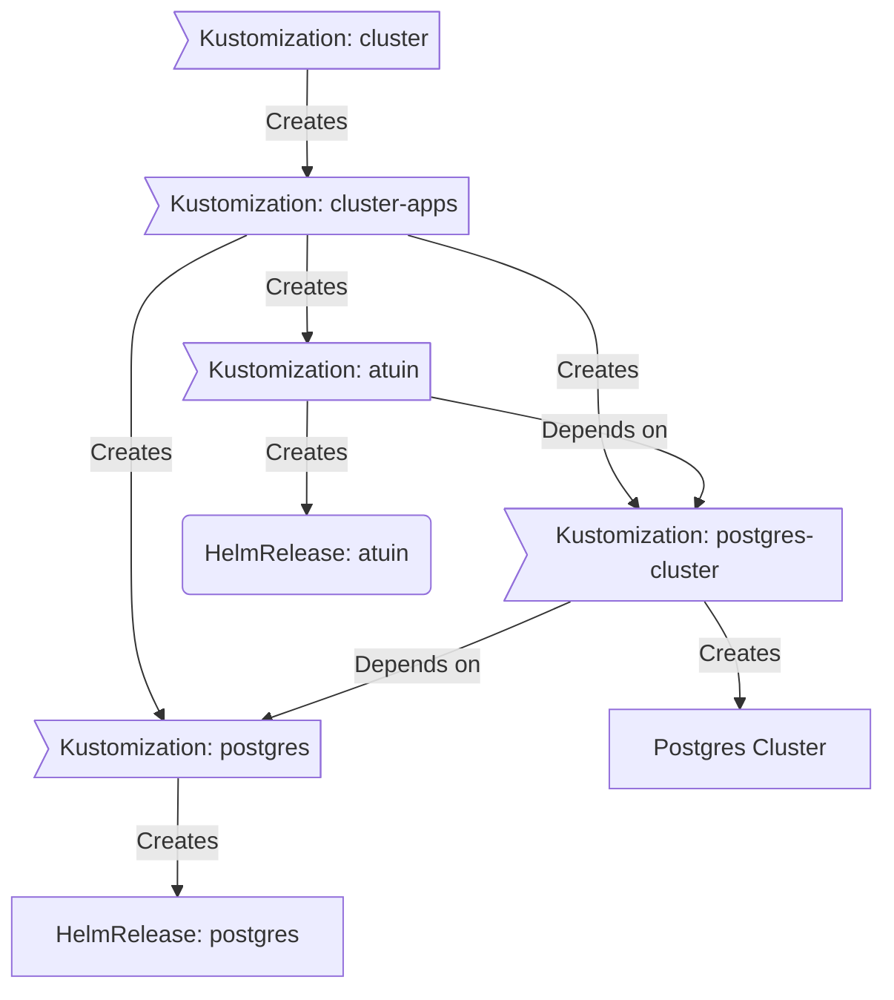
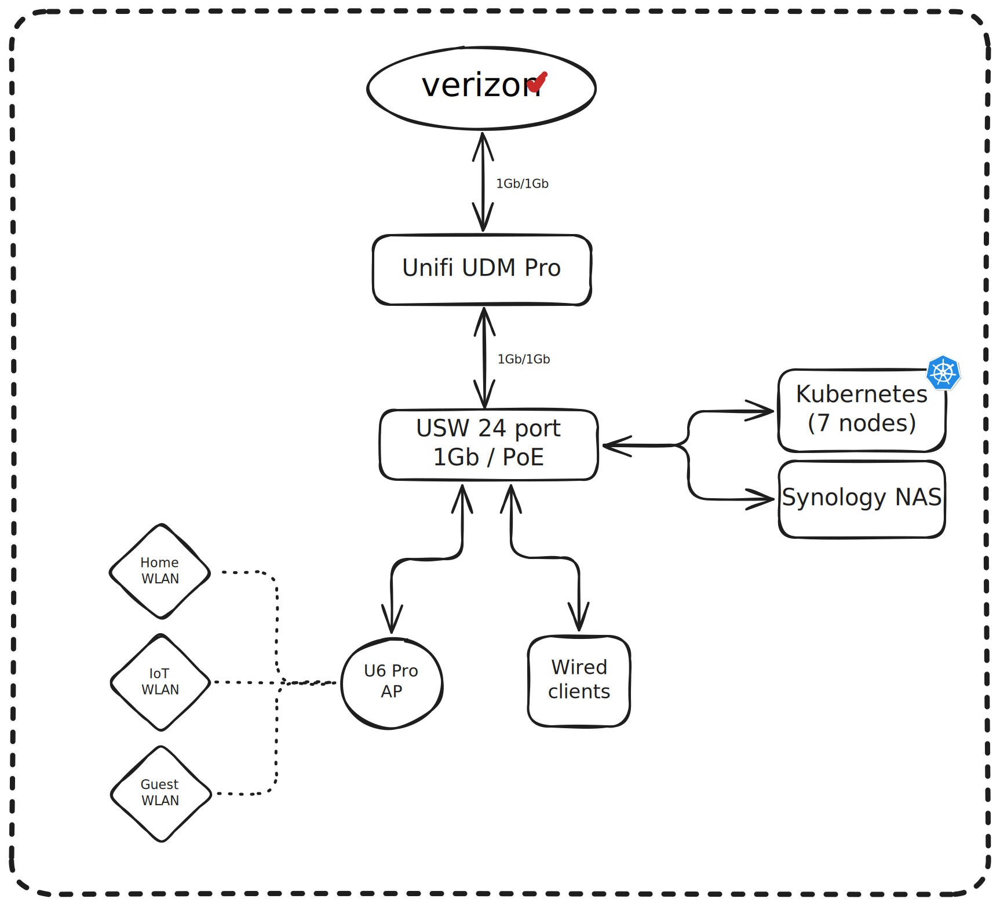

<div align="center">


### My homelab k8s cluster 

_... automated via [Flux](https://github.com/fluxcd/flux2), [Renovate](https://github.com/renovatebot/renovate) and [GitHub Actions](https://github.com/features/actions)_ 

</div>

<div align="center">

[](https://talos.dev)&nbsp;&nbsp;
[](https://kubernetes.io)&nbsp;&nbsp;
[](https://github.com/zebernst/homelab/actions/workflows/renovate.yaml)

</div>

<div align="center">

[](https://status.zebernst.dev)&nbsp;&nbsp;
[](https://status.zebernst.dev)&nbsp;&nbsp;
[](https://status.zebernst.dev)
</div>

<div align="center">

[](https://github.com/kashalls/kromgo)&nbsp;&nbsp;
[](https://github.com/kashalls/kromgo)&nbsp;&nbsp;
[](https://github.com/kashalls/kromgo)&nbsp;&nbsp;
[](https://github.com/kashalls/kromgo)&nbsp;&nbsp;
[](https://github.com/kashalls/kromgo)&nbsp;&nbsp;
[](https://github.com/kashalls/kromgo)&nbsp;&nbsp;
[](https://github.com/kashalls/kromgo)

</div>

---

##  Overview

This is a repository for my home infrastructure and Kubernetes cluster. I try to adhere to Infrastructure as Code (IaC) and GitOps practices using tools like [Kubernetes](https://github.com/kubernetes/kubernetes), [Flux](https://github.com/fluxcd/flux2), [Renovate](https://github.com/renovatebot/renovate) and [GitHub Actions](https://github.com/features/actions).

---

##  Kubernetes

This semi-hyper-converged cluster runs [Talos Linux](https://github.com/siderolabs/talos), an immutable and ephemeral Linux distribution tailored for [Kubernetes](https://github.com/kubernetes/kubernetes), and is deployed on bare-metal Minisforum MS-01 mini-PCs. Currently, persistent file storage is provided via a custom fork of the [Synology CSI](https://github.com/zebernst/synology-csi-talos), however I plan to incorporate [Rook](https://github.com/rook/rook) in order to enable block- and object-storage within the cluster. A separate NAS handles media file storage and backups. The cluster is designed to enable a full teardown without any data loss.

🔸 _[Click here](./kubernetes/bootstrap/talos/talconfig.yaml) to see my Talos configuration._

There is a template at [onedr0p/cluster-template](https://github.com/onedr0p/cluster-template) if you want to follow along with many of the practices I use here.

### Core Components

[//]: # (- [actions-runner-controller]&#40;https://github.com/actions/actions-runner-controller&#41;: Self-hosted Github runners.)
- [cert-manager](https://github.com/cert-manager/cert-manager): Manage SSL certificates for services in my cluster.
- [cilium](https://github.com/cilium/cilium): Internal Kubernetes container networking interface (CNI).
- [cloudflared](https://github.com/cloudflare/cloudflared): Enables external access to certain services via Cloudflare tunnels.
- [external-dns](https://github.com/kubernetes-sigs/external-dns): Automatically syncs ingress DNS records to a DNS provider.
- [external-secrets](https://github.com/external-secrets/external-secrets): Managed Kubernetes secrets using [1Password Connect](https://github.com/1Password/connect).
- [ingress-nginx](https://github.com/kubernetes/ingress-nginx): Kubernetes ingress controller using NGINX as a reverse proxy and load balancer.
- [rook](https://github.com/rook/rook): Distributed block, file, and object storage for stateful workloads. [**WIP**]
- [sops](https://github.com/getsops/sops): Managed secrets for Kubernetes which are commited to Git. (Used solely for initial bootstrapping of cluster)
- [spegel](https://github.com/spegel-org/spegel): Stateless cluster-local OCI registry mirror.
- [volsync](https://github.com/backube/volsync): Backup and recovery of persistent volume claims.

### GitOps

[Flux](https://github.com/fluxcd/flux2) monitors my [kubernetes](./kubernetes) folder (see Directories below) and implements changes to my cluster based on the YAML manifests.

Flux operates by recursively searching the [kubernetes/apps](./kubernetes/apps) folder until it locates the top-level `kustomization.yaml` in each directory. It then applies all the resources listed in it. This `kustomization.yaml` typically contains a namespace resource and one or more Flux kustomizations. These Flux kustomizations usually include a `HelmRelease` or other application-related resources, which are then applied.

[Renovate](https://github.com/renovatebot/renovate) monitors my **entire** repository for dependency updates, automatically creating a PR when updates are found. When the relevant PRs are merged, [Flux](https://github.com/fluxcd/flux2) then applies the changes to my cluster.

### Directories

This Git repository contains the following directories under [kubernetes/](./kubernetes).

```sh
📁 kubernetes
├── 📁 apps           # applications
├── 📁 bootstrap      # bootstrap procedures
├── 📁 flux           # core flux configuration
└── 📁 templates      # reusable components
```

### Cluster layout

This is a high-level look how Flux deploys my applications with dependencies. Below there are 3 Flux kustomizations `postgres`, `postgres-cluster`, and `atuin`. `postgres` is the first app that needs to be running and healthy before `postgres-cluster` and once `postgres-cluster` is healthy, then `atuin` will be deployed.



### Networking

<details>
  <summary>Click to see a high-level network diagram</summary>

  
</details>

---

##  DNS

In my cluster there are two instances of [ExternalDNS](https://github.com/kubernetes-sigs/external-dns) running: one for syncing private DNS records to my router using the [ExternalDNS webhook provider for UniFi](https://github.com/kashalls/external-dns-unifi-webhook), and another instance for syncing public DNS records to Cloudflare. This setup is managed by creating ingresses with two specific classes: `internal` for private DNS and `external` for public DNS. The `external-dns` instances then sync the DNS records to their respective platforms.

I also run [Tailscale](https://tailscale.com/kb/1236/kubernetes-operator) in my cluster, which serves as both a Kubernetes auth proxy (used with [Nautik](https://nautik.io/) to monitor and administer my Kubernetes cluster on-the-go), as well as to provide remote access to services while I'm not on my home network. Creating an ingress with the `tailscale` class will expose the application to my Tailnet, and automagically configure DNS records and HTTPS certificates for the tailnet accordingly.

---

##  Cloud Dependencies

While most of my infrastructure and workloads are self-hosted, I do rely upon the cloud for certain key parts of my setup. This saves me from having to worry about three things:
1. Dealing with chicken/egg scenarios
2. Critical services that need to be accessible, whether my cluster is online or not.
3. The "hit by a bus" scenario - what happens to critical apps (e.g. Email, Password Manager, Photos, etc.) that my friends and family rely on when I'm no longer around.

Alternative solutions to the first two of these problems would be to host a Kubernetes cluster in the cloud and deploy applications like [Vault](https://www.vaultproject.io/), [Vaultwarden](https://github.com/dani-garcia/vaultwarden), [ntfy](https://ntfy.sh/), and [Gatus](https://gatus.io/); however, maintaining another cluster and monitoring another group of workloads would frankly be more time and effort than I am willing to put in. (and would probably cost more or equal out to the same costs as described below)

| Service                                     | Use                                                               | Cost           |
|---------------------------------------------|-------------------------------------------------------------------|----------------|
| [1Password](https://1password.com/)         | Secrets with [External Secrets](https://external-secrets.io/)     | ~$36/yr        |
| [Cloudflare](https://www.cloudflare.com/)   | Domain/DNS                                                        | ~$24/yr        |
| [Backblaze](https://www.backblaze.com)      | S3-compatible object storage                                      | ~$36/yr        |
| [GitHub](https://github.com/)               | Hosting this repository and continuous integration/deployments    | Free           |
| [Pushover](https://pushover.net/)           | Kubernetes Alerts and application notifications                   | $5 OTP         |
| [UptimeRobot](https://uptimerobot.com/)     | Monitoring internet connectivity and external facing applications | Free           |
| [Healthchecks.io](https://healthchecks.io/) | Dead man's switch for monitoring cron jobs                        | Free           |
|                                             |                                                                   | Total: ~$10/mo |

---

##  Hardware

<details>
  <summary>Click to see my rack</summary>

  
</details>


| Device                  | Count | OS Disk     | Data Disk                                                              | RAM  | OS          | Purpose         |
|-------------------------|-------|-------------|------------------------------------------------------------------------|------|-------------|-----------------|
| MS-01 (i9-12900H)       | 3     | 1TB M.2 SSD | -                                                                      | 32GB | Talos Linux | Kubernetes      |
| Synology DS918+         | 1     | -           | 2x14TB&nbsp;HDD + 2x18TB&nbsp;HDD + 2x1TB&nbsp;SSD&nbsp;R/W&nbsp;Cache | 16GB | DSM 7       | NAS/NFS/Backup  |
| JetKVM                  | 2     | -           | -                                                                      | -    | -           | KVM             |
| Home Assistant Yellow   | 1     | 8GB eMMC    | 1TB M.2 SSD                                                            | 4GB  | HAOS        | Home Automation |
| UniFi UDM Pro           | 1     | -           | -                                                                      | -    | UniFi OS    | Router          |
| UniFi USW Pro 24 PoE    | 1     | -           | -                                                                      | -    | UniFi OS    | Core Switch     |
| Unifi USP PDU Pro       | 1     | -           | -                                                                      | -    | UniFi OS    | PDU             |
| CyberPower OR500LCDRM1U | 1     | -           | -                                                                      | -    | -           | UPS             |

---

##  Gratitude and Thanks

Huge thank-you to the folks over on the [Home Operations](https://discord.gg/home-operations) Discord community, especially [@onedrop](https://github.com/onedr0p), [@bjw-s](https://github.com/bjw-s), and [@buroa](https://github.com/buroa). Their home-ops repos have been an amazing resource to reference as I embarked on this journey.

Be sure to check out [kubesearch.dev](https://kubesearch.dev) for further ideas and reference for deploying applications on Kubernetes.

---

##  Changelog

See the latest [release](https://github.com/zebernst/homelab/releases/latest) notes.

---

##  License

See [LICENSE](./LICENSE).
