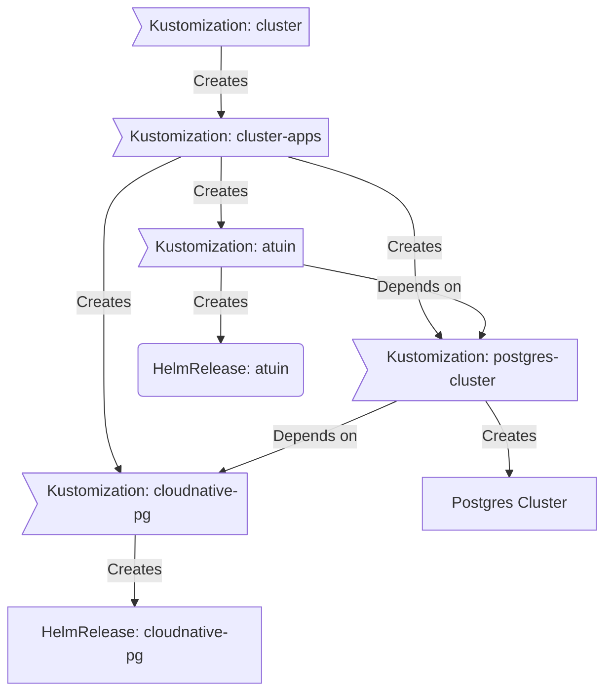
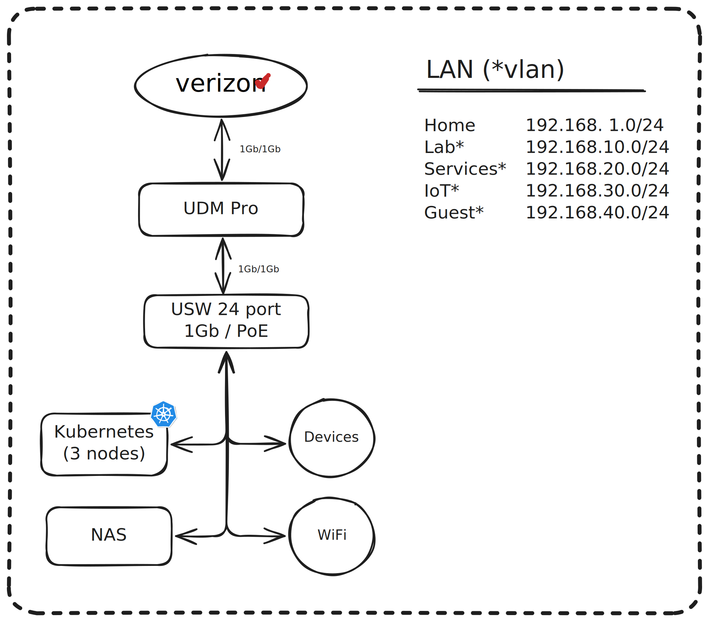

<div align="center">


### My homelab k8s cluster 

_... automated via [Flux](https://github.com/fluxcd/flux2), [Renovate](https://github.com/renovatebot/renovate) and [GitHub Actions](https://github.com/features/actions)_ 

</div>

<div align="center">

[](https://talos.dev)&nbsp;&nbsp;
[](https://kubernetes.io)&nbsp;&nbsp;
[](https://fluxcd.io)&nbsp;&nbsp;
[](https://github.com/zebernst/homelab/actions/workflows/renovate.yaml)

</div>

<div align="center">

[](https://status.zebernst.dev)&nbsp;&nbsp;
[](https://status.zebernst.dev)&nbsp;&nbsp;
[](https://status.zebernst.dev)
</div>

<div align="center">

[](https://github.com/kashalls/kromgo)&nbsp;&nbsp;
[](https://github.com/kashalls/kromgo)&nbsp;&nbsp;
[](https://github.com/kashalls/kromgo)&nbsp;&nbsp;
[](https://github.com/kashalls/kromgo)&nbsp;&nbsp;
[](https://github.com/kashalls/kromgo)&nbsp;&nbsp;
[](https://github.com/kashalls/kromgo)&nbsp;&nbsp;
[](https://github.com/kashalls/kromgo)

</div>

---

##  Overview

This is a repository for my home infrastructure and Kubernetes cluster. I try to adhere to Infrastructure as Code (IaC) and GitOps practices using tools like [Kubernetes](https://github.com/kubernetes/kubernetes), [Flux](https://github.com/fluxcd/flux2), [Renovate](https://github.com/renovatebot/renovate) and [GitHub Actions](https://github.com/features/actions).

---

##  Kubernetes

This hyper-converged cluster runs [Talos Linux](https://github.com/siderolabs/talos), an immutable and ephemeral Linux distribution tailored for [Kubernetes](https://github.com/kubernetes/kubernetes), and is deployed on bare-metal Minisforum MS-01 mini-PCs. Currently, persistent storage is provided via [Rook](https://github.com/rook/rook) in order to enable resilient block-, file-, and object-storage within the cluster. A Synology NAS handles media file storage and backups, and is also available as an alternate storage location with the help of a [custom fork](https://github.com/zebernst/synology-csi-talos) of the official Synology CSI for workloads that should not be hyper-converged. The cluster is designed to enable a full teardown without any data loss.

🔸 _[Click here](./kubernetes/bootstrap/talos/talconfig.yaml) to see my Talos configuration._

There is a template at [onedr0p/cluster-template](https://github.com/onedr0p/cluster-template) if you want to follow along with many of the practices I use here.

### Core Components

[//]: # (- [actions-runner-controller]&#40;https://github.com/actions/actions-runner-controller&#41;: Self-hosted Github runners.)
- [cert-manager](https://github.com/cert-manager/cert-manager): Manage SSL certificates for services in my cluster.
- [cilium](https://github.com/cilium/cilium): eBPF-based networking for my workloads.
- [cloudflared](https://github.com/cloudflare/cloudflared): Enables Cloudflare secure access to my services.
- [external-dns](https://github.com/kubernetes-sigs/external-dns): Automatically syncs ingress DNS records to a DNS provider.
- [external-secrets](https://github.com/external-secrets/external-secrets): Managed Kubernetes secrets using [1Password Connect](https://github.com/1Password/connect).
- [ingress-nginx](https://github.com/kubernetes/ingress-nginx): Kubernetes ingress controller using NGINX as a reverse proxy and load balancer.
- [rook](https://github.com/rook/rook): Distributed block, file, and object storage for stateful workloads.
- [spegel](https://github.com/spegel-org/spegel): Stateless cluster-local OCI registry mirror.
- [volsync](https://github.com/backube/volsync): Backup and recovery of persistent volume claims.

### GitOps

[Flux](https://github.com/fluxcd/flux2) monitors my [kubernetes](./kubernetes) folder (see Directories below) and implements changes to my cluster based on the YAML manifests.

Flux operates by recursively searching the [kubernetes/apps](./kubernetes/apps) folder until it locates the top-level `kustomization.yaml` in each directory. It then applies all the resources listed in it. This `kustomization.yaml` typically contains a namespace resource and one or more Flux kustomizations. These Flux kustomizations usually include a `HelmRelease` or other application-related resources, which are then applied.

[Renovate](https://github.com/renovatebot/renovate) monitors my **entire** repository for dependency updates, automatically creating a PR when updates are found. When the relevant PRs are merged, [Flux](https://github.com/fluxcd/flux2) then applies the changes to my cluster.

### Directories

This Git repository contains the following directories under [kubernetes/](./kubernetes).

```sh
📁 kubernetes
├── 📁 apps           # applications
├── 📁 bootstrap      # bootstrap procedures
├── 📁 components     # reusable kustomize components
└── 📁 flux           # core flux configuration
```

### Cluster layout

This is a high-level look how Flux deploys my applications with dependencies. Below there are 3 Flux kustomizations `cloudnative-pg`, `postgres-cluster`, and `atuin`. `cloudnative-pg` is the first app that needs to be running and healthy before `postgres-cluster` and once `postgres-cluster` is healthy, then `atuin` will be deployed.



---

##  Networking & DNS

<details>
  <summary>Click to see a high-level phsyical network diagram</summary>

  
</details>

Apps hosted on my cluster are exposed using any combination of three different methods, depending on their use-case, security requirements, and intended audience. All three methods utilise fully encrypted HTTPS connections – TLS certificates are automatically provisioned and renewed by [Cert Manager](https://cert-manager.io) for each application.

### Local Network

The first and easiest way that an app can be exposed is strictly on my local network. This is most often used for apps and services that have to do with home automation – given that every smart home device is on my local network, there is no need to expose e.g. a supporting service like MQTT any further than that.

Local deployments are accomplished by creating an Ingress of type `internal`, which will register a virtual IP for the service in a designated subnet (advertised via BGP) and provision a DNS record on the router with  the [ExternalDNS webhook provider for UniFi](https://github.com/kashalls/external-dns-unifi-webhook).

### Privately Exposed (Tailscale)

The second and most common way that an app can be exposed is via [Tailscale](https://tailscale.com/kb/1236/kubernetes-operator). Creating an Ingress with the `tailscale` class will expose the application to my Tailnet, and [automagically](https://tailscale.com/kb/1081/magicdns) configure DNS records. Most self-hosted apps and dashboards are exposed using this Ingress class, so that they are accessible on my personal devices at a consistent URL no matter if I'm at home or abroad.

Tailscale also serves as a Kubernetes auth proxy, which I use in conjunction with the [Nautik](https://nautik.io/) iOS app to monitor and administer my Kubernetes cluster on-the-go.

### Publicly Exposed

The final and least common way to expose an app is via `cloudflared`, the [Cloudflare Tunnel](https://developers.cloudflare.com/cloudflare-one/connections/connect-networks/) daemon. By routing all external traffic through Cloudflare's infrastructure, I gain the benefits of their global security infrastructure (notably DDoS protection). This is generally used for webhook endpoints which require access from the wider Internet, though I do expose a select few apps for friends and family.

Creating an `external` Ingress will trigger using [ExternalDNS](https://github.com/kubernetes-sigs/external-dns) to provision a CNAME DNS record on Cloudflare which points at the Cloudflare Tunnel endpoint. The tunnel routes traffic securely into my cluster, where the ingress controller further routes it to the destination Service.

---

##  Cloud Dependencies

While most of my infrastructure and workloads are self-hosted, I do rely upon the cloud for certain key parts of my setup. This saves me from having to worry about three things:
1. Dealing with chicken/egg scenarios
2. Critical services that need to be accessible, whether my cluster is online or not.
3. The "hit by a bus" scenario - what happens to critical apps (e.g. Email, Password Manager, Photos, etc.) that my friends and family rely on when I'm no longer around.

Alternative solutions to the first two of these problems would be to host a Kubernetes cluster in the cloud and deploy applications like [Vault](https://www.vaultproject.io/), [Vaultwarden](https://github.com/dani-garcia/vaultwarden), [ntfy](https://ntfy.sh/), and [Gatus](https://gatus.io/); however, maintaining another cluster and monitoring another group of workloads would frankly be more time and effort than I am willing to put in. (and would probably cost more or equal out to the same costs as described below)

| Service                                     | Use                                                               | Cost           |
|---------------------------------------------|-------------------------------------------------------------------|----------------|
| [1Password](https://1password.com/)         | Secrets with [External Secrets](https://external-secrets.io/)     | ~$36/yr        |
| [Cloudflare](https://www.cloudflare.com/)   | Domain/DNS                                                        | ~$24/yr        |
| [Backblaze](https://www.backblaze.com)      | S3-compatible object storage                                      | ~$36/yr        |
| [GitHub](https://github.com/)               | Hosting this repository and continuous integration/deployments    | Free           |
| [Pushover](https://pushover.net/)           | Kubernetes Alerts and application notifications                   | $5 OTP         |
| [UptimeRobot](https://uptimerobot.com/)     | Monitoring internet connectivity and external facing applications | Free           |
| [Healthchecks.io](https://healthchecks.io/) | Dead man's switch for monitoring cron jobs                        | Free           |
|                                             |                                                                   | Total: ~$10/mo |

---

##  Hardware

<details>
  <summary>Click to see my rack</summary>

  
</details>


| Device                      | Count | OS Disk     | Data Disk                                                              | RAM  | OS          | Purpose                    |
|-----------------------------|-------|-------------|------------------------------------------------------------------------|------|-------------|----------------------------|
| MS-01 (i9-12900H)           | 3     | 1TB M.2 SSD | 2TB M.2 SSD (Rook)                                                     | 96GB | Talos Linux | Kubernetes (control plane) |
| Custom build ([link][pcpp]) | 1     | 1TB M.2 SSD | 4TB M.2 SSD                                                            | 96GB | Talos Linux | Kubernetes (gpu workloads) |
| Synology DS918+             | 1     | -           | 2x14TB&nbsp;HDD + 2x18TB&nbsp;HDD + 2x1TB&nbsp;SSD&nbsp;R/W&nbsp;Cache | 16GB | DSM 7       | NAS/NFS/Backup             |
| JetKVM                      | 2     | -           | -                                                                      | -    | -           | KVM                        |
| Home Assistant Yellow       | 1     | 8GB eMMC    | 1TB M.2 SSD                                                            | 4GB  | HAOS        | Home Automation            |
| UniFi UDM Pro               | 1     | -           | -                                                                      | -    | UniFi OS    | Router                     |
| UniFi USW Pro 24 PoE        | 1     | -           | -                                                                      | -    | UniFi OS    | Core Switch                |
| Unifi USP PDU Pro           | 1     | -           | -                                                                      | -    | UniFi OS    | PDU                        |
| CyberPower OR500LCDRM1U     | 1     | -           | -                                                                      | -    | -           | UPS                        |

---

##  Gratitude and Thanks

Huge thank-you to the folks over at the [Home Operations](https://github.com/home-operations) community, especially [@onedrop](https://github.com/onedr0p), [@bjw-s](https://github.com/bjw-s), and [@buroa](https://github.com/buroa) – their home-ops repos have been an amazing resource to draw upon.

Be sure to check out [kubesearch.dev](https://kubesearch.dev) for further ideas and reference for deploying applications on Kubernetes.

---

##  Changelog

See the latest [release](https://github.com/zebernst/homelab/releases/latest) notes.

---

##  License

See [LICENSE](./LICENSE).

[pcpp]: https://pcpartpicker.com/b/qLrD4D
