# Cluster Platform Architecture

Generated from Flux `Kustomization.spec.dependsOn`, declared Kustomize components,
and Helm/manifest monitoring configuration (ServiceMonitor, PodMonitor, VMServiceScrape).
Deploy edges define reconcile ordering; operational edges are separate edge kinds.

## Architecture layers

Conceptual layers aligned with [PriorityClass](../../kubernetes/apps/kube-system/priority-class/)
semantics — substrate first, then platform services, shared data, AI, and workloads.
Customize layer and partition rules in [`tier-categories.yaml`](tier-categories.yaml).

| Layer | Role | PriorityClass analog |
| --- | --- | --- |
| Substrate | Cluster cannot run without | `system-node-critical`, core CNI/DNS |
| Platform | Shared services workloads need | `network-critical`, `control-plane-critical`, `storage-critical` |
| Data | Shared databases and cache | `database-critical` |
| AI | Shared inference | — |
| Workloads | User-facing apps | `external-facing`, `media-core`, `best-effort` |

```mermaid
flowchart BT

  subgraph layer_substrate["Substrate — Cluster-critical infrastructure the cluster cannot run without"]
    subgraph substrate_substrate_cluster["cluster"]
      cilium["cilium"]
      snapshot_controller["snapshot-controller"]
    end
    subgraph substrate_substrate_gitops["gitops"]
      cluster_meta["cluster-meta"]
    end
  end

  subgraph layer_platform["Platform — Shared services that workloads depend on"]
    subgraph platform_platform_auth["auth"]
      pocket_id["pocket-id"]
    end
    subgraph platform_platform_data_operators["data operators"]
      cloudnative_pg["cloudnative-pg"]
    end
    subgraph platform_platform_gitops["gitops"]
      cluster_apps["cluster-apps"]
      flux_operator["flux-operator"]
    end
    subgraph platform_platform_networking["networking"]
      ingress_nginx_external["ingress-nginx-external"]
      ingress_nginx_internal["ingress-nginx-internal"]
    end
    subgraph platform_platform_observability["observability"]
      victoria_logs["victoria-logs"]
      victoria_metrics["victoria-metrics"]
      victoria_metrics_operator["victoria-metrics-operator"]
    end
    subgraph platform_platform_secrets["secrets"]
      cluster_secrets["cluster-secrets"]
      external_secrets["external-secrets"]
      onepassword["onepassword"]
    end
    subgraph platform_platform_security["security"]
      cert_manager["cert-manager"]
      cert_manager_issuers["cert-manager-issuers"]
    end
    subgraph platform_platform_storage["storage"]
      rook_ceph["rook-ceph"]
      rook_ceph_cluster["rook-ceph-cluster"]
      volsync["volsync"]
    end
  end

  subgraph layer_data["Data — Shared databases and cache clusters"]
    subgraph data_data_cache["cache"]
      dragonfly_cluster["dragonfly-cluster"]
    end
    subgraph data_data_postgres["postgres"]
      cloudnative_pg_cluster["cloudnative-pg-cluster"]
    end
  end

  subgraph layer_ai["AI — Shared inference infrastructure"]
    subgraph ai_ai_inference["inference"]
      ollama["ollama"]
    end
  end

  subgraph layer_workloads["Workloads — User-facing applications"]
    subgraph workloads_workloads["applications"]
      workloads_ai["AI<br/>(4 ks)"]
      workloads_downloads["Downloads<br/>(20 ks)"]
      workloads_fission["Fission<br/>(3 ks)"]
      workloads_games["Games<br/>(5 ks)"]
      workloads_kube_system["Kube System<br/>(13 ks)"]
      workloads_media["Media<br/>(11 ks)"]
      workloads_self_hosted["Self-Hosted<br/>(13 ks)"]
      workloads_system_upgrade["System Upgrade<br/>(2 ks)"]
    end
  end

  cert_manager_issuers --> cert_manager
  cloudnative_pg --> onepassword
  cloudnative_pg_cluster --> cloudnative_pg
  cluster_apps --> cluster_meta
  cluster_secrets --> onepassword
  ollama --> rook_ceph_cluster
  onepassword --> external_secrets
  pocket_id --> cloudnative_pg_cluster
  pocket_id --> onepassword
  pocket_id --> rook_ceph_cluster
  pocket_id --> volsync
  rook_ceph --> snapshot_controller
  rook_ceph_cluster --> rook_ceph
  victoria_logs --> rook_ceph_cluster
  victoria_metrics --> onepassword
  victoria_metrics --> rook_ceph_cluster
  victoria_metrics --> victoria_metrics_operator
  workloads_ai --> ollama
  workloads_ai --> onepassword
  workloads_ai --> rook_ceph_cluster
  workloads_ai --> victoria_metrics
  workloads_ai --> volsync
  workloads_downloads --> cloudnative_pg_cluster
  workloads_downloads --> onepassword
  workloads_downloads --> rook_ceph_cluster
  workloads_downloads --> volsync
  workloads_fission --> onepassword
  workloads_fission --> rook_ceph_cluster
  workloads_games --> onepassword
  workloads_games --> rook_ceph_cluster
  workloads_games --> volsync
  workloads_media --> cloudnative_pg_cluster
  workloads_media --> onepassword
  workloads_media --> rook_ceph_cluster
  workloads_media --> volsync
  workloads_self_hosted --> cloudnative_pg
  workloads_self_hosted --> cloudnative_pg_cluster
  workloads_self_hosted --> cluster_secrets
  workloads_self_hosted --> dragonfly_cluster
  workloads_self_hosted --> onepassword
  workloads_self_hosted --> rook_ceph_cluster
  workloads_self_hosted --> volsync
```



## Load-bearing view (Stacktower)

Stacktower emphasizes fan-out and load-bearing platforms; the Mermaid chart above
emphasizes named layers and platform partitions. Use both: Mermaid for architecture
storytelling, Stacktower for dependency density and DR prioritization stats.


Regenerate with `task architecture:diagram` (requires [Stacktower](https://github.com/stacktower-io/stacktower)).

## Load-bearing platforms

| Platform | Direct dependents | Layer | dependsOn depth |
| --- | ---: | --- | ---: |
| `external-secrets/onepassword` | 53 | Platform | 1 |
| `rook-ceph/rook-ceph-cluster` | 42 | Platform | 2 |
| `volsync-system/volsync` | 30 | Platform | 0 |
| `database/cloudnative-pg-cluster` | 20 | Data | 3 |
| `observability/victoria-metrics-operator` | 5 | Platform | 0 |
| `cert-manager/cert-manager` | 3 | Platform | 0 |
| `cert-manager/cert-manager-issuers` | 3 | Platform | 1 |
| `observability/victoria-metrics` | 2 | Platform | 3 |
| `database/cloudnative-pg` | 2 | Platform | 2 |
| `kube-system/cilium` | 2 | Substrate | 0 |
| `kube-system/snapshot-controller` | 2 | Substrate | 0 |
| `observability/victoria-logs` | 2 | Platform | 3 |
| `external-secrets/external-secrets` | 1 | Platform | 0 |
| `rook-ceph/rook-ceph` | 1 | Platform | 1 |
| `flux-system/cluster-meta` | 1 | Substrate | 0 |

## Kustomizations by layer

### Substrate

- `flux-system/cluster-meta` (1 dependents)
- `kube-system/cilium` (2 dependents)
- `kube-system/coredns`
- `kube-system/kubelet-csr-approver`
- `kube-system/metrics-server`
- `kube-system/node-feature-discovery` (1 dependents)
- `kube-system/reloader`
- `kube-system/snapshot-controller` (2 dependents)
- `kube-system/spegel`

### Platform

- `auth/pocket-id` (1 dependents)
- `auth/tinyauth`
- `cert-manager/cert-manager` (3 dependents)
- `cert-manager/cert-manager-issuers` (3 dependents)
- `cert-manager/cert-manager-tls` (2 dependents)
- `cert-manager/step-issuer` (2 dependents)
- `cert-manager/step-issuer-issuers` (1 dependents)
- `cert-manager/step-issuer-tls`
- `database/cloudnative-pg` (2 dependents)
- `database/dragonfly` (1 dependents)
- `external-secrets/cluster-secrets` (1 dependents)
- `external-secrets/external-secrets` (1 dependents)
- `external-secrets/onepassword` (53 dependents)
- `flux-system/cluster-apps`
- `flux-system/flux-instance`
- `flux-system/flux-operator` (1 dependents)
- `kube-system/cilium-config` (1 dependents)
- `kube-system/cilium-gateway`
- `kube-system/synology-csi-driver`
- `network/cloudflared`
- `network/echo-server`
- `network/external-dns-cloudflare`
- `network/external-dns-unifi`
- `network/ingress-nginx-external`
- `network/ingress-nginx-internal`
- `network/smtp-relay` (1 dependents)
- `network/tailscale-operator`
- `observability/blackbox-exporter` (1 dependents)
- `observability/blackbox-exporter-probes`
- `observability/fluent-bit`
- `observability/gatus`
- `observability/grafana`
- `observability/karma`
- `observability/keda`
- `observability/kromgo`
- `observability/silence-operator` (1 dependents)
- `observability/silence-operator-silences`
- `observability/smartctl-exporter`
- `observability/snmp-exporter`
- `observability/unpoller`
- `observability/victoria-logs` (2 dependents)
- `observability/victoria-metrics` (2 dependents)
- `observability/victoria-metrics-operator` (5 dependents)
- `observability/vmalert`
- `openebs-system/openebs` (1 dependents)
- `rook-ceph/rook-ceph` (1 dependents)
- `rook-ceph/rook-ceph-cluster` (42 dependents)
- `volsync-system/volsync` (30 dependents)

### Data

- `database/cloudnative-pg-cluster` (20 dependents)
- `database/dragonfly-cluster` (2 dependents)
- `database/mariadb` (1 dependents)

### AI

- `ai/ollama` (3 dependents)

### Workloads

- AI: 4 Kustomizations
- Downloads: 20 Kustomizations
- Fission: 3 Kustomizations
- Games: 5 Kustomizations
- Kube System: 13 Kustomizations
- Media: 11 Kustomizations
- Self-Hosted: 13 Kustomizations
- System Upgrade: 2 Kustomizations


## Flux dependsOn depth

Longest-path depth from `dependsOn` — useful for reconcile ordering, distinct from layer assignment.

### Depth 0

- `cert-manager/cert-manager` (3 dependents)
- `database/dragonfly` (1 dependents)
- `external-secrets/external-secrets` (1 dependents)
- `fission/fission-crds` (1 dependents)
- `flux-system/cluster-meta` (1 dependents)
- `flux-system/flux-operator` (1 dependents)
- `kube-system/cilium` (2 dependents)
- `kube-system/node-feature-discovery` (1 dependents)
- `kube-system/self-node-remediation` (1 dependents)
- `kube-system/snapshot-controller` (2 dependents)
- `observability/silence-operator` (1 dependents)
- `observability/victoria-metrics-operator` (5 dependents)
- `openebs-system/openebs` (1 dependents)
- `system-upgrade/tuppr` (1 dependents)
- `volsync-system/volsync` (30 dependents)

### Depth 1

- `cert-manager/cert-manager-issuers` (3 dependents)
- `cert-manager/step-issuer` (2 dependents)
- `database/dragonfly-cluster` (2 dependents)
- `external-secrets/onepassword` (53 dependents)
- `flux-system/cluster-apps`
- `kube-system/cilium-config` (1 dependents)
- `kube-system/node-healthcheck` (1 dependents)
- `observability/blackbox-exporter` (1 dependents)
- `rook-ceph/rook-ceph` (1 dependents)

### Depth 2

- `cert-manager/cert-manager-tls` (2 dependents)
- `cert-manager/step-issuer-issuers` (1 dependents)
- `database/cloudnative-pg` (2 dependents)
- `external-secrets/cluster-secrets` (1 dependents)
- `network/smtp-relay` (1 dependents)
- `rook-ceph/rook-ceph-cluster` (42 dependents)

### Depth 3

- `ai/ollama` (3 dependents)
- `database/cloudnative-pg-cluster` (20 dependents)
- `database/mariadb` (1 dependents)
- `downloads/qbittorrent` (3 dependents)
- `fission/fission` (1 dependents)
- `games/bluemap` (3 dependents)
- `observability/victoria-logs` (2 dependents)
- `observability/victoria-metrics` (2 dependents)
- `self-hosted/nominatim` (1 dependents)

### Depth 4

- `ai/holmesgpt` (1 dependents)
- `auth/pocket-id` (1 dependents)
- `downloads/sonarr` (1 dependents)

## Synthetic monitoring (Gatus component)

These workloads expose HTTP checks via the shared Gatus component.
Edge direction: `observability/gatus` → workload.

- `downloads/qbittorrent`
- `media/plex`
- `media/seerr`
- `media/wizarr`
- `observability/gatus`
- `observability/kromgo`
- `self-hosted/atuin`
- `self-hosted/rxresume`

## Metrics scraping (Prometheus / Victoria Metrics)

Detected from Helm chart values (`serviceMonitor`, `podMonitor`, `monitoring.enabled`)
and raw Victoria Metrics scrape CRs in Git. These are first-class cluster relationships
even when the chart renders the monitor object instead of a checked-in manifest.

Edge direction: `observability/victoria-metrics-operator` → workload.

- `ai/ollama` (VMProbe)
- `ai/open-webui` (VMProbe)
- `auth/pocket-id` (serviceMonitor)
- `auth/tinyauth` (VMProbe)
- `database/dragonfly` (serviceMonitor)
- `database/dragonfly-cluster` (VMPodScrape)
- `database/mariadb` (serviceMonitor)
- `downloads/autobrr` (serviceMonitor)
- `downloads/bazarr` (serviceMonitor)
- `downloads/bazarr-uhd` (serviceMonitor)
- `downloads/cross-seed` (VMProbe)
- `downloads/flaresolverr` (VMProbe)
- `downloads/lidarr` (serviceMonitor)
- `downloads/omegabrr` (VMProbe)
- `downloads/openbooks` (VMProbe)
- `downloads/prowlarr` (serviceMonitor)
- `downloads/qbittorrent` (VMProbe)
- `downloads/qui` (serviceMonitor)
- `downloads/radarr` (serviceMonitor)
- `downloads/radarr-uhd` (serviceMonitor)
- `downloads/seasonpackarr` (VMProbe)
- `downloads/sonarr` (serviceMonitor)
- `downloads/sonarr-uhd` (serviceMonitor)
- `downloads/unpackerr` (serviceMonitor)
- `downloads/whisparr` (VMProbe)
- `external-secrets/external-secrets` (serviceMonitor)
- `external-secrets/onepassword` (VMProbe)
- `fission/fission` (serviceMonitor)
- `flux-system/flux-operator` (serviceMonitor)
- `games/atm10` (serviceMonitor)
- `games/atmons` (serviceMonitor)
- `games/mc-router` (serviceMonitor)
- `games/vanilla` (serviceMonitor)
- `kube-system/cilium` (serviceMonitor)
- `kube-system/descheduler` (serviceMonitor)
- `kube-system/kubelet-csr-approver` (serviceMonitor)
- `kube-system/metrics-server` (serviceMonitor)
- `kube-system/node-feature-discovery` (serviceMonitor)
- `kube-system/node-problem-detector` (serviceMonitor)
- `kube-system/reloader` (podMonitor)
- `kube-system/snapshot-controller` (serviceMonitor)
- `kube-system/spegel` (serviceMonitor)
- `media/agregarr` (VMProbe)
- `media/booklore` (VMProbe)
- `media/capacitarr` (VMProbe)
- `media/maintainerr` (VMProbe)
- `media/shelfmark` (VMProbe)
- `media/stash` (VMProbe)
- `media/steam` (VMProbe)
- `media/tautulli` (VMProbe)
- `network/cloudflared` (serviceMonitor)
- `network/echo-server` (serviceMonitor)
- `network/external-dns-cloudflare` (serviceMonitor)
- `network/ingress-nginx-external` (serviceMonitor)
- `network/ingress-nginx-internal` (serviceMonitor)
- `network/smtp-relay` (serviceMonitor)
- `observability/blackbox-exporter` (serviceMonitor)
- `observability/blackbox-exporter-probes` (VMProbe)
- `observability/fluent-bit` (serviceMonitor)
- `observability/gatus` (serviceMonitor)
- `observability/grafana` (serviceMonitor)
- `observability/karma` (serviceMonitor)
- `observability/keda` (serviceMonitor)
- `observability/smartctl-exporter` (serviceMonitor)
- `observability/snmp-exporter` (serviceMonitor)
- `observability/unpoller` (serviceMonitor)
- `observability/victoria-logs` (serviceMonitor)
- `observability/victoria-metrics-operator` (serviceMonitor)
- `observability/vmalert` (serviceMonitor)
- `rook-ceph/rook-ceph` (monitoring, serviceMonitor)
- `rook-ceph/rook-ceph-cluster` (monitoring)
- `self-hosted/atuin` (serviceMonitor)
- `self-hosted/dawarich` (serviceMonitor)
- `self-hosted/glance` (VMProbe)
- `self-hosted/hajimari` (VMProbe)
- `self-hosted/homebox` (VMProbe)
- `self-hosted/it-tools` (VMProbe)
- `self-hosted/mealie` (VMProbe)
- `self-hosted/nocodb` (VMProbe)
- `self-hosted/nominatim` (VMProbe)
- `self-hosted/paperless` (serviceMonitor)
- `self-hosted/radicale` (VMProbe)
- `self-hosted/unwrapped` (VMProbe)
- `volsync-system/volsync` (VMServiceScrape)

## Operational edge summary

- `metrics`: 84
- `monitor`: 8
- `backup`: 32
- `scale`: 17

## Artifacts

- `platform-deploy.svg` — Stacktower load-bearing view (committed)
- `platform-tiers.mmd` — Mermaid layer model source (committed; also embedded above)
- `tier-categories.yaml` — layer and partition assignment rules
- `platform-deploy.json`, `platform-operational.json`, `full-deploy.json` — generated locally by `task architecture:graph` (gitignored)

```bash
task architecture:diagram
stacktower stats docs/architecture/platform-deploy.json
```
