# Cluster Platform Architecture

Generated from Flux `Kustomization.spec.dependsOn`. Customize vertical tiers, groups,
and partitions in [`tier-categories.yaml`](tier-categories.yaml).

| Vertical tier | Groups | Role |
| --- | --- | --- |
| Substrate | Substrate | Cluster cannot run without |
| Infrastructure | Platform · Observability | Infra providers vs metrics/logs/checks |
| Shared services | Data · AI | Shared Postgres/Redis and inference |
| Workloads | Workloads | User-facing applications |

```mermaid
flowchart BT

  %% Deploy-order edges from Flux Kustomization.spec.dependsOn

  subgraph vt0["Substrate — Cluster-critical infrastructure the cluster cannot run without"]
    subgraph g_substrate["Substrate"]
      subgraph p_substrate_substrate_cluster["cluster"]
        cilium["cilium"]
        class cilium substrate
        snapshot_controller["snapshot-controller"]
        class snapshot_controller substrate
      end
      subgraph p_substrate_substrate_gitops["gitops"]
        cluster_meta["cluster-meta"]
        class cluster_meta substrate
      end
    end
  end

  subgraph vt1["Infrastructure — Platform providers and observability at the same tier, distinct groups"]
    subgraph g_platform["Platform — Secrets, networking, auth, storage, security, gitops"]
      subgraph p_platform_platform_auth["auth"]
        pocket_id["pocket-id"]
        class pocket_id platform
      end
      subgraph p_platform_platform_data_operators["data operators"]
        cloudnative_pg["cloudnative-pg"]
        class cloudnative_pg platform
      end
      subgraph p_platform_platform_gitops["gitops"]
        cluster_apps["cluster-apps"]
        class cluster_apps platform
        flux_operator["flux-operator"]
        class flux_operator platform
      end
      subgraph p_platform_platform_networking["networking"]
        ingress_nginx_external["ingress-nginx-external"]
        class ingress_nginx_external platform
        ingress_nginx_internal["ingress-nginx-internal"]
        class ingress_nginx_internal platform
      end
      subgraph p_platform_platform_secrets["secrets"]
        cluster_secrets["cluster-secrets"]
        class cluster_secrets platform
        external_secrets["external-secrets"]
        class external_secrets platform
        onepassword["onepassword<br/>(53 deps)"]
        class onepassword platform
      end
      subgraph p_platform_platform_security["security"]
        cert_manager["cert-manager"]
        class cert_manager platform
        cert_manager_issuers["cert-manager-issuers"]
        class cert_manager_issuers platform
      end
      subgraph p_platform_platform_storage["storage"]
        rook_ceph["rook-ceph"]
        class rook_ceph platform
        rook_ceph_cluster["rook-ceph-cluster<br/>(42 deps)"]
        class rook_ceph_cluster platform
        volsync["volsync<br/>(30 deps)"]
        class volsync platform
      end
    end
    subgraph g_observability["Observability — Metrics, logs, alerting, synthetic checks — not an infra provider"]
      subgraph p_observability_observability_metrics["metrics"]
        victoria_metrics["victoria-metrics"]
        class victoria_metrics observability
        victoria_metrics_operator["victoria-metrics-operator<br/>(5 deps)"]
        class victoria_metrics_operator observability
      end
    end
  end

  subgraph vt2["Shared services — Data and AI at the same tier, distinct groups"]
    subgraph g_data["Data — Shared databases and cache clusters"]
      subgraph p_data_data_cache["cache"]
        dragonfly_cluster["dragonfly-cluster"]
        class dragonfly_cluster data
      end
      subgraph p_data_data_postgres["postgres"]
        cloudnative_pg_cluster["cloudnative-pg-cluster<br/>(20 deps)"]
        class cloudnative_pg_cluster data
      end
    end
    subgraph g_ai["AI — Shared inference infrastructure"]
      subgraph p_ai_ai_inference["inference"]
        ollama["ollama"]
        class ollama ai
      end
    end
  end

  subgraph vt3["Workloads — User-facing applications"]
    subgraph g_workloads["Workloads"]
      wl_ai["AI<br/>(4 ks)"]
      class wl_ai workloads
      wl_downloads["Downloads<br/>(20 ks)"]
      class wl_downloads workloads
      wl_fission["Fission<br/>(3 ks)"]
      class wl_fission workloads
      wl_games["Games<br/>(5 ks)"]
      class wl_games workloads
      wl_kube_system["Kube System<br/>(13 ks)"]
      class wl_kube_system workloads
      wl_media["Media<br/>(11 ks)"]
      class wl_media workloads
      wl_self_hosted["Self-Hosted<br/>(13 ks)"]
      class wl_self_hosted workloads
      wl_system_upgrade["System Upgrade<br/>(2 ks)"]
      class wl_system_upgrade workloads
    end
  end

  %% dependsOn edges (dependent --> dependency)
  cert_manager_issuers --> cert_manager
  cloudnative_pg --> onepassword
  cloudnative_pg_cluster --> cloudnative_pg
  cluster_apps --> cluster_meta
  cluster_secrets --> onepassword
  ollama --> rook_ceph_cluster
  onepassword --> external_secrets
  pocket_id --> cloudnative_pg_cluster
  pocket_id --> onepassword
  pocket_id --> rook_ceph_cluster
  pocket_id --> volsync
  rook_ceph --> snapshot_controller
  rook_ceph_cluster --> rook_ceph
  victoria_metrics --> onepassword
  victoria_metrics --> rook_ceph_cluster
  victoria_metrics --> victoria_metrics_operator
  wl_ai --> ollama
  wl_ai --> onepassword
  wl_ai --> rook_ceph_cluster
  wl_ai --> victoria_metrics
  wl_ai --> volsync
  wl_downloads --> cloudnative_pg_cluster
  wl_downloads --> onepassword
  wl_downloads --> rook_ceph_cluster
  wl_downloads --> volsync
  wl_fission --> onepassword
  wl_fission --> rook_ceph_cluster
  wl_games --> onepassword
  wl_games --> rook_ceph_cluster
  wl_games --> volsync
  wl_media --> cloudnative_pg_cluster
  wl_media --> onepassword
  wl_media --> rook_ceph_cluster
  wl_media --> volsync
  wl_self_hosted --> cloudnative_pg
  wl_self_hosted --> cloudnative_pg_cluster
  wl_self_hosted --> cluster_secrets
  wl_self_hosted --> dragonfly_cluster
  wl_self_hosted --> onepassword
  wl_self_hosted --> rook_ceph_cluster
  wl_self_hosted --> volsync

  %% group styling
  classDef substrate fill:#1f2937,stroke:#9ca3af,color:#f9fafb
  classDef platform fill:#1e3a5f,stroke:#60a5fa,color:#eff6ff
  classDef observability fill:#312e81,stroke:#a78bfa,color:#f5f3ff
  classDef data fill:#14532d,stroke:#4ade80,color:#f0fdf4
  classDef ai fill:#581c87,stroke:#d8b4fe,color:#faf5ff
  classDef workloads fill:#422006,stroke:#fbbf24,color:#fffbeb
```

Regenerate: `task architecture:graph`

## Load-bearing platforms

Kustomizations with the most direct `dependsOn` inbound edges.

| Kustomization | Dependents | Group | dependsOn depth |
| --- | ---: | --- | ---: |
| `external-secrets/onepassword` | 53 | Platform | 1 |
| `rook-ceph/rook-ceph-cluster` | 42 | Platform | 2 |
| `volsync-system/volsync` | 30 | Platform | 0 |
| `database/cloudnative-pg-cluster` | 20 | Data | 3 |
| `observability/victoria-metrics-operator` | 5 | Observability | 0 |
| `ai/ollama` | 3 | AI | 3 |
| `cert-manager/cert-manager` | 3 | Platform | 0 |
| `cert-manager/cert-manager-issuers` | 3 | Platform | 1 |
| `downloads/qbittorrent` | 3 | Workloads | 3 |
| `games/bluemap` | 3 | Workloads | 3 |
| `observability/victoria-metrics` | 2 | Observability | 3 |
| `cert-manager/step-issuer` | 2 | Platform | 1 |
| `database/cloudnative-pg` | 2 | Platform | 2 |
| `kube-system/cilium` | 2 | Substrate | 0 |
| `kube-system/snapshot-controller` | 2 | Substrate | 0 |

## Kustomizations by group

### Substrate

**Substrate**

- `flux-system/cluster-meta` (1 deps)
- `kube-system/cilium` (2 deps)
- `kube-system/coredns`
- `kube-system/kubelet-csr-approver`
- `kube-system/metrics-server`
- `kube-system/node-feature-discovery` (1 deps)
- `kube-system/reloader`
- `kube-system/snapshot-controller` (2 deps)
- `kube-system/spegel`

### Infrastructure

**Platform**

- `auth/pocket-id` (1 deps)
- `auth/tinyauth`
- `cert-manager/cert-manager` (3 deps)
- `cert-manager/cert-manager-issuers` (3 deps)
- `cert-manager/cert-manager-tls` (2 deps)
- `cert-manager/step-issuer` (2 deps)
- `cert-manager/step-issuer-issuers` (1 deps)
- `cert-manager/step-issuer-tls`
- `database/cloudnative-pg` (2 deps)
- `database/dragonfly` (1 deps)
- `external-secrets/cluster-secrets` (1 deps)
- `external-secrets/external-secrets` (1 deps)
- `external-secrets/onepassword` (53 deps)
- `flux-system/cluster-apps`
- `flux-system/flux-instance`
- `flux-system/flux-operator` (1 deps)
- `kube-system/cilium-config` (1 deps)
- `kube-system/cilium-gateway`
- `kube-system/synology-csi-driver`
- `network/cloudflared`
- `network/echo-server`
- `network/external-dns-cloudflare`
- `network/external-dns-unifi`
- `network/ingress-nginx-external`
- `network/ingress-nginx-internal`
- `network/smtp-relay` (1 deps)
- `network/tailscale-operator`
- `openebs-system/openebs` (1 deps)
- `rook-ceph/rook-ceph` (1 deps)
- `rook-ceph/rook-ceph-cluster` (42 deps)
- `volsync-system/volsync` (30 deps)

**Observability**

- `observability/blackbox-exporter` (1 deps)
- `observability/blackbox-exporter-probes`
- `observability/fluent-bit`
- `observability/gatus`
- `observability/grafana`
- `observability/karma`
- `observability/keda`
- `observability/kromgo`
- `observability/silence-operator` (1 deps)
- `observability/silence-operator-silences`
- `observability/smartctl-exporter`
- `observability/snmp-exporter`
- `observability/unpoller`
- `observability/victoria-logs` (2 deps)
- `observability/victoria-metrics` (2 deps)
- `observability/victoria-metrics-operator` (5 deps)
- `observability/vmalert`

### Shared services

**Data**

- `database/cloudnative-pg-cluster` (20 deps)
- `database/dragonfly-cluster` (2 deps)
- `database/mariadb` (1 deps)

**AI**

- `ai/ollama` (3 deps)

### Workloads

**Workloads**

- AI: 4
- Downloads: 20
- Fission: 3
- Games: 5
- Kube System: 13
- Media: 11
- Self-Hosted: 13
- System Upgrade: 2

## Artifacts

- [`platform-tiers.mmd`](platform-tiers.mmd) — Mermaid source (also embedded above)
- [`tier-categories.yaml`](tier-categories.yaml) — vertical tiers, groups, partitions
