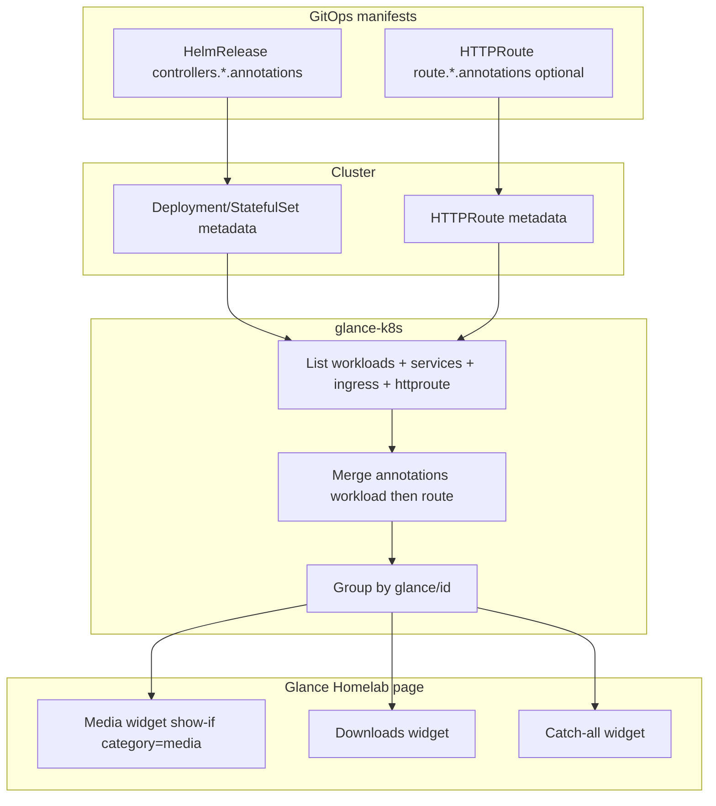

# feat: Annotate cluster routes for glance-k8s grouping

## Summary

Add `glance/*` annotations to user-facing workloads across the homelab so glance-k8s displays correctly named, categorized app tiles with stable URLs. Fix glance-k8s HTTPRoute RBAC, restructure the Homelab page into category widgets, and roll out annotations namespace-by-namespace using app-template controller annotations plus standalone HTTPRoute metadata where needed.

---

## Problem Frame

Glance with the glance-k8s sidecar is deployed and discovers ingresses/HTTPRoutes, but every app appears as an undifferentiated auto-discovered tile: default kubernetes icons, TitleCase workload names, and unreliable URLs (especially for Gateway API routes). The Homelab page uses a single Apps widget with only a `kube-system` and `glance/hide` filter. No workload in the repo sets `glance/name`, `glance/id`, `glance/url`, or category metadata. HTTPRoute list RBAC is missing, so Gateway-only apps cannot auto-resolve URLs even when routes exist.

---

## Assumptions

*This plan was authored without synchronous user confirmation. Review these bets before implementation.*

- **Primary URL policy:** Glance tile links use the URL you would open from the home LAN — `https://<app>.zebernst.dev` or `https://<app>.internal` for Gateway routes, and `https://<app>.kite-harmonic.ts.net` for Tailscale-only apps until they gain Gateway HTTPRoutes.
- **Category taxonomy:** User-facing categories map to Kubernetes namespaces (`media`, `downloads`, `self-hosted`, `ai`, `auth`, `games`, `observability`) via a custom `glance/category` annotation. This is intentionally simpler than `docs/architecture/tier-categories.yaml` platform tiers, which describe Flux deploy ordering rather than dashboard UX.
- **Transition layout:** Category widgets are added alongside the existing permissive Apps widget until annotation rollout completes; the legacy widget is removed only in the final cleanup unit (U8). A catch-all widget (for annotated apps missing `glance/category`) is optional during partial rollout but does not replace the legacy widget.
- **Platform UIs:** User-facing observability apps (Gatus, Grafana, Karma, Kromgo, Victoria Metrics) appear under `glance/category: observability`. Operators and infra (external-dns, volsync, CNPG operator, echo-server, flux webhook) get `glance/hide: "true"`.
- **Multi-route grouping:** Apps with internal + external + Tailscale routes always get an explicit `glance/url` on the main controller; route-level annotations are used only when a route-specific URL override is needed.
- **Architecture branch:** `cursor/architecture-graph-cf7b` informs naming and grouping intuition but is not authoritative for Glance categories.

---

## Requirements

- R1. Every user-facing app with an ingress or HTTPRoute displays a human-readable name, appropriate icon, and a working primary URL in Glance.
- R2. Apps are grouped into category sections on the Homelab page (Media, Downloads, Self-Hosted, AI, Auth, Games, Observability) using glance-k8s `show-if` filters.
- R3. Infrastructure, operators, debug tools, and redirect-only routes do not appear as user app tiles.
- R4. Multi-route and dual-stack apps (pocket-id, rxresume, ollama, qui, tautulli, etc.) link to a single canonical URL, not an arbitrary discovered route.
- R5. glance-k8s can list HTTPRoutes cluster-wide so Gateway API routes participate in discovery and annotation merge.
- R6. Multi-component apps (minecraft ecosystem, future sidecar groupings) can collapse into one tile via `glance/id` / `glance/parent`.
- R7. Annotation changes live in GitOps manifests — app-template controller annotations, upstream chart annotation values, Kustomize workload patches, or standalone HTTPRoute metadata — following patterns established in U2 catalog.

---

## Scope Boundaries

- Changing Gateway, ExternalDNS, or ingress-nginx configuration
- Completing the cluster-wide Ingress → HTTPRoute migration (annotations must survive migration, not drive it)
- Replacing manual Infrastructure / Smart Home monitor widgets in `glance.yml` with glance-k8s discovery (those are non-K8s or special-case endpoints)
- Building automation to generate annotations from Flux architecture graphs (optional follow-up)
- Upgrading Glance core beyond what Renovate or a deliberate bump requires

### Deferred to Follow-Up Work

- Script to audit annotation coverage vs live HTTPRoute/Ingress inventory (`scripts/glance-annotate-audit.py`)
- Aligning `glance/category` values with `docs/architecture/tier-categories.yaml` platform/* labels for platform-tier UIs
- Per-route annotation on Tailscale Ingress objects once app-template ingress annotation support is verified for all apps
- Merging architecture diagram generation from `cursor/architecture-graph-cf7b` into main

---

## Context & Research

### Relevant Code and Patterns

- Glance deployment: `kubernetes/apps/self-hosted/glance/app/helmrelease.yaml` — sidecar, RBAC, route
- Glance config: `kubernetes/apps/self-hosted/glance/app/resources/glance.yml` — Homelab page, Apps widget, `show-if` filter
- App-template annotation placement: `controllers.<name>.annotations` on Deployment metadata (existing reloader pattern in e.g. `kubernetes/apps/media/tautulli/app/helmrelease.yaml`)
- App-template route annotations: `route.<key>.annotations` for HTTPRoute metadata overrides
- Standalone HTTPRoutes: `kubernetes/apps/ai/ollama/app/httproute.yaml`, `kubernetes/apps/fission/app/httproute.yaml`, `kubernetes/apps/flux-system/flux-operator/instance/webhook/httproute.yaml`
- Gateway definitions: `kubernetes/apps/kube-system/cilium/gateway/`
- ~33 Tailscale Ingress blocks, ~25 app-template HTTPRoute blocks, ~10 standalone HTTPRoutes across 12 namespaces

### Institutional Learnings

- No `docs/solutions/` corpus exists yet; capture learnings after rollout via `/ce-compound`
- Open beads epic `homelab-1lm` tracks Ingress → HTTPRoute modernization — annotations must not assume nginx Ingress remains
- glance-k8s v0.4.8 is deployed; v0.5.0 adds List() caching valuable when splitting into multiple category widgets

### External References

- [glance-k8s README](https://github.com/lukasdietrich/glance-k8s/blob/master/README.md) — annotation vocabulary, widget `show-if` parameters
- [glance-k8s HTTPRoute support](https://github.com/lukasdietrich/glance-k8s/issues/31)
- [bjw-s app-template route template](https://github.com/bjw-s-labs/helm-charts/blob/main/charts/library/common/templates/classes/_route.tpl) — `route.*.annotations`

---

## Key Technical Decisions

- **Annotate workloads, not routes alone:** glance-k8s discovers Deployments/StatefulSets/DaemonSets and merges route annotations as overrides. Primary metadata goes on `controllers.*.annotations`; `glance/url` is set explicitly on the controller for multi-route apps.
- **Custom `glance/category` annotation:** Not built into glance-k8s, but fully supported by expr-lang `show-if` filters. Values: `media`, `downloads`, `self-hosted`, `ai`, `auth`, `games`, `observability`.
- **RBAC before category widgets:** Add `gateway.networking.k8s.io/httproutes` list permission; drop unused `ingressclasses` from Glance ClusterRole. Consider bumping glance-k8s to v0.5.0 in the same unit for cache behavior.
- **Rollout sequencing:** Catalog (U2) → multi-route URL stabilization (U1b) → RBAC fix (U1) → hide pass (U4) → namespace annotation passes (U5–U7) → category widgets alongside legacy Apps (U3) → remove legacy widget (U8). Never deploy RBAC before multi-route apps have explicit `glance/url`.
- **Annotation placement by chart type:** app-template apps use `controllers.*.annotations`; upstream charts use chart-specific pod/deployment annotation values (e.g. Ollama chart `podAnnotations`) or a Kustomize `patch` on the rendered Deployment/StatefulSet; route-only metadata on standalone HTTPRoute YAML is a fallback when no workload patch is practical (fission router Service owner).
- **HD/UHD pairs:** Separate `glance/id` per instance (e.g. `radarr-hd`, `radarr-uhd`) with distinct names and URLs — do not group.
- **Minecraft grouping:** Shared `glance/id: minecraft` on router (main); `glance/parent: minecraft` on bluemap and route-less server StatefulSets (vanilla, atm10, atmons) so they collapse under one tile or stay hidden from standalone discovery.

---

## Open Questions

### Resolved During Planning

- **Where do annotations go?** Workload controller annotations (primary); HTTPRoute/Ingress annotations for URL overrides only.
- **What categories?** Namespace-aligned user categories, not Flux platform tiers.
- **Hide vs show policy?** Explicit `glance/hide: "true"` for infra; catch-all widget for uncategorized but annotated apps.

### Deferred to Implementation

- Exact Simple Icons / dashboard-icons shorthand per app (pick during each namespace PR; reference [dashboard-icons](https://github.com/walkxcode/dashboard-icons) and [Simple Icons](https://simpleicons.org/))
- Whether rook-ceph S3 (`s3.zebernst.dev`) should appear as a user tile or remain hidden
- Whether fission router and ics-proxy share a tile or ics-proxy is hidden

---

## High-Level Technical Design

> *This illustrates the intended approach and is directional guidance for review, not implementation specification. The implementing agent should treat it as context, not code to reproduce.*

**Minimum annotation set per user-facing app:**

| Key | Required | Purpose |
|-----|----------|---------|
| `glance/id` | Yes | Stable identity; enables future grouping |
| `glance/name` | Yes | Display title |
| `glance/icon` | Yes | `si:` or `di:` shorthand |
| `glance/url` | Yes for multi-route; recommended everywhere | Canonical link |
| `glance/category` | Yes | Category widget filter |
| `glance/hide` | For infra only | Exclude from all widgets |
| `glance/parent` | Multi-workload only | Group under main app |
| `glance/description` | Optional | Subtitle |

---

## Implementation Units

- U1b. **Stabilize multi-route URLs before RBAC**

**Goal:** Set explicit `glance/url` on all dual-stack and multi-route apps so enabling HTTPRoute discovery cannot flip tile links.

**Requirements:** R4

**Dependencies:** U2

**Files:**
- Modify: HelmReleases for every app listed in U2 `multi_route` section (pocket-id, rxresume, ollama, qui, tautulli, victoria-metrics, mc-router, and any app with both Tailscale Ingress and Gateway HTTPRoute)

**Approach:**
- Apply only `glance/url` (and `glance/id` if missing) from the U2 catalog — defer name/icon/category to U5–U7
- For upstream charts without `controllers.*`, use chart-native annotation keys or Kustomize patches (see Key Technical Decisions)
- Ship and verify before U1 merges

**Test scenarios:**
- Happy path: pocket-id tile URL unchanged before and after U1 RBAC deploy
- Happy path: qui/tautulli link to internal `*.zebernst.dev`, not tailnet hostname

**Verification:**
- Every `multi_route` catalog entry has `glance/url` on its workload before U1 proceeds

---

- U1. **Fix glance-k8s RBAC and sidecar version**

**Goal:** Enable HTTPRoute discovery and improve multi-widget performance.

**Requirements:** R5

**Dependencies:** U1b

**Files:**
- Modify: `kubernetes/apps/self-hosted/glance/app/helmrelease.yaml`

**Approach:**
- Add ClusterRole rule: `apiGroups: [gateway.networking.k8s.io]`, `resources: [httproutes]`, `verbs: [list]`
- Remove `ingressclasses` from RBAC (unused by glance-k8s)
- Bump `ghcr.io/lukasdietrich/glance-k8s/glance-k8s` to v0.5.0 (or latest compatible patch) for List() cache

**Patterns to follow:**
- Existing RBAC block in glance HelmRelease
- Upstream glance-k8s chart rbac.yaml

**Test scenarios:**
- Integration: `kubectl auth can-i list httproutes --as=system:serviceaccount:self-hosted:glance` returns `yes`
- Integration: glance-k8s sidecar starts without RBAC Forbidden errors in logs
- Happy path: `/extension/apps` returns apps with URLs for a Gateway-only app (e.g. nominatim) without explicit `glance/url`

**Verification:**
- Glance ServiceAccount can list HTTPRoutes cluster-wide
- At least one internal Gateway app auto-discovers a URL post-deploy

---

- U2. **Define annotation catalog and hide list**

**Goal:** Document the canonical category values, naming conventions, and apps to hide before bulk edits.

**Requirements:** R2, R3, R7

**Dependencies:** None (can parallel U1)

**Files:**
- Create: `docs/architecture/glance-annotations.yaml`

**Approach:**
- YAML catalog keyed by `namespace/app` with fields: `glance/id`, `glance/name`, `glance/icon`, `glance/url`, `glance/category`, optional `glance/hide`, optional `glance/parent`
- Include a `hidden` section listing operators and infra workloads (echo-server, flux webhook receiver, tailscale-operator, volsync, external-secrets, CNPG operator, victoria-metrics-operator, flaresolverr, etc.)
- Include a `multi_route` section flagging apps requiring mandatory `glance/url` (pocket-id, rxresume, ollama, qui, tautulli, victoria-metrics, mc-router)
- Derive initial entries from repo inventory (~50 user-facing apps); use architecture branch namespace groupings as hints, not source of truth

**Patterns to follow:**
- `docs/architecture/tier-categories.yaml` structure from `cursor/architecture-graph-cf7b` (separate concerns: Flux tiers vs Glance UX)

**Test scenarios:**
- Test expectation: none — documentation/catalog artifact; validated by review against ingress/HTTPRoute inventory

**Verification:**
- Catalog covers every namespace with user-facing routes from Phase 1 research inventory
- Every multi-route app is flagged in `multi_route`
- Hidden workloads list matches infra/debug apps that should not appear in Glance

---

- U3. **Add category widgets alongside legacy Apps widget**

**Goal:** Introduce per-category extension widgets without breaking the Homelab page during partial annotation rollout.

**Requirements:** R2

**Dependencies:** U2, U5 (at least one annotated app per category as pilot)

**Files:**
- Modify: `kubernetes/apps/self-hosted/glance/app/resources/glance.yml`

**Approach:**
- **Keep** the existing permissive Apps widget unchanged until U8 removes it
- Add category extension widgets (Media, Downloads, Self-Hosted, AI, Auth, Games, Observability) in the full column below or beside the legacy widget
- Each category widget uses the base `show-if` guard (`kube-system` exclusion + `glance/hide`) plus `annotations["glance/category"] == "<value>"`
- Optionally add a catch-all widget for annotated apps missing `glance/category` (does not replace legacy widget)
- Set `cache: 1s` on all new widgets
- Keep Infrastructure, Smart Home, and Nodes widgets unchanged

**Patterns to follow:**
- Existing Apps widget parameters in `glance.yml`
- glance-k8s README multi-widget `show-if` examples

**Test scenarios:**
- Happy path: Homelab page loads without expr-lang parse errors
- Edge case: Catch-all widget shows apps annotated with name/id but no category during partial rollout
- Integration: Category widget shows only apps matching its category after U4–U7 land

**Verification:**
- Glance config validates against glance-schema
- Each category widget renders independently with correct filtering

---

- U4. **Hide pass — infrastructure and debug workloads**

**Goal:** Remove dashboard noise from operators and non-user apps before URL/category rollout.

**Requirements:** R3

**Dependencies:** U1, U2

**Files:**
- Modify: `kubernetes/apps/network/echo-server/app/helmrelease.yaml`
- Modify: flux webhook workload manifest (identify Deployment/HelmRelease backing webhook receiver)
- Modify: operator HelmReleases as listed in U2 catalog (external-secrets, volsync, CNPG, tailscale-operator, etc.) — `controllers.*.annotations.glance/hide: "true"`

**Approach:**
- Add `glance/hide: "true"` to controllers for infra workloads that glance-k8s would otherwise discover
- Do not hide user-facing UIs (Gatus, Grafana, etc.)

**Patterns to follow:**
- `controllers.<name>.annotations` block with existing reloader annotation

**Test scenarios:**
- Happy path: echo-server no longer appears in `/extension/apps` output
- Happy path: Gatus/Grafana still appear (no hide annotation)
- Edge case: Hidden workload with `glance/hide` does not appear in any category widget or catch-all

**Verification:**
- `/extension/apps` response excludes all catalogued hidden workloads

---

- U5. **Annotate auth, AI, games, and network namespaces**

**Goal:** Complete annotations for smaller namespaces first to validate patterns.

**Requirements:** R1, R4, R6, R7

**Dependencies:** U2, U4

**Files:**
- Modify: `kubernetes/apps/auth/pocket-id/app/helmrelease.yaml`
- Modify: `kubernetes/apps/auth/tinyauth/app/helmrelease.yaml`
- Modify: `kubernetes/apps/ai/ollama/app/` (Deployment/HelmRelease + `httproute.yaml` if workload annotations go on HelmRelease)
- Modify: `kubernetes/apps/ai/open-webui/app/httproute.yaml` and workload manifest
- Modify: `kubernetes/apps/ai/paperless-ai/app/httproute.yaml` and workload manifest
- Modify: `kubernetes/apps/games/minecraft/router/app/helmrelease.yaml`
- Modify: `kubernetes/apps/games/minecraft/bluemap/app/helmrelease.yaml`
- Modify: `kubernetes/apps/games/minecraft/vanilla/app/helmrelease.yaml`
- Modify: `kubernetes/apps/games/minecraft/atm10/app/helmrelease.yaml`
- Modify: `kubernetes/apps/games/minecraft/atmons/app/helmrelease.yaml`
- Modify: `kubernetes/apps/fission/app/httproute.yaml` and fission router Deployment patch (Kustomize) or HTTPRoute metadata
- Modify: `kubernetes/apps/fission/functions/ics-proxy/httproute.yaml` (hide or explicit URL with path)
- Modify: `kubernetes/apps/rook-ceph/rook-ceph/cluster/helmrelease.yaml` (dashboard hide; S3 route per deferred decision)

**Approach:**
- Apply catalog entries from U2 to each controller
- pocket-id: mandatory `glance/url: https://id.zebernst.dev`, `glance/category: auth`
- ollama: single tile with `glance/url` picking primary (recommend `https://ollama.internal` for LAN AI use)
- minecraft: `glance/id: minecraft` on router; `glance/parent: minecraft` on bluemap and server StatefulSets (vanilla, atm10, atmons) so they do not appear as undiscovered standalone tiles
- fission: patch the `router` Deployment (Kustomize strategic merge) with glance annotations, or set metadata on `httproute.yaml` plus `glance/url` if workload patch is impractical
- ollama (upstream chart): use chart `podAnnotations` or a Kustomize Deployment patch — no app-template `controllers` block

**Patterns to follow:**
- `controllers.*.annotations` in app-template HelmReleases
- Kustomize `patches` targeting Deployments/StatefulSets for upstream charts (ollama, fission, grafana, victoria-metrics stack)
- Metadata annotations on standalone HTTPRoute YAML for route-only resources

**Test scenarios:**
- Happy path: pocket-id shows one tile linking to `id.zebernst.dev`
- Happy path: ollama shows one tile with chosen primary URL
- Edge case: rxresume-style redirect routes are not used as primary URL (if annotated in this or next unit)
- Integration: Auth, AI, Games category widgets populate after Flux reconcile

**Verification:**
- All apps in auth/ai/games namespaces with user-facing routes appear in correct category widgets with working links

---

- U6. **Annotate media and downloads namespaces**

**Goal:** Annotate the largest app groups (~34 workloads) with names, icons, URLs, and categories.

**Requirements:** R1, R4, R7

**Dependencies:** U2, U4

**Files:**
- Modify: all HelmReleases under `kubernetes/apps/media/*/app/helmrelease.yaml`
- Modify: all HelmReleases under `kubernetes/apps/downloads/*/app/**/helmrelease.yaml` (including hd/uhd variants)

**Approach:**
- `glance/category: media` or `downloads` per namespace
- Distinct `glance/id` for hd/uhd pairs (radarr-hd, radarr-uhd, sonarr-hd, sonarr-uhd, bazarr-hd, bazarr-uhd)
- Tailscale-only apps: `glance/url` set to `https://<app>.kite-harmonic.ts.net`
- Dual-stack apps (qui, tautulli): explicit `glance/url` to internal `*.zebernst.dev` hostname
- External-facing media apps (plex, seerr, wizarr, booklore): `glance/url` to public hostname

**Patterns to follow:**
- Catalog from U2
- Existing per-app hostname conventions in each HelmRelease route/ingress block

**Test scenarios:**
- Happy path: radarr-hd and radarr-uhd appear as two distinct tiles with distinct URLs
- Happy path: qui links to `qui.zebernst.dev`, not tailnet hostname
- Edge case: qbittorrent tools/flaresolverr sidecars hidden or parented, not standalone tiles
- Integration: Media and Downloads widgets show full app sets

**Verification:**
- Spot-check 3 internal-route, 3 tailscale-only, and 2 hd/uhd pair apps in Glance UI

---

- U7. **Annotate self-hosted and observability namespaces**

**Goal:** Complete annotation coverage for remaining user-facing apps.

**Requirements:** R1, R4, R7

**Dependencies:** U2, U4

**Files:**
- Modify: HelmReleases under `kubernetes/apps/self-hosted/*/app/helmrelease.yaml` (except glance itself)
- Modify: `kubernetes/apps/observability/gatus/app/helmrelease.yaml`
- Modify: `kubernetes/apps/observability/grafana/app/helmrelease.yaml`
- Modify: `kubernetes/apps/observability/karma/app/helmrelease.yaml`
- Modify: `kubernetes/apps/observability/kromgo/app/helmrelease.yaml`
- Modify: `kubernetes/apps/observability/victoria-metrics/app/helmrelease.yaml`
- Modify: `kubernetes/apps/observability/victoria-logs/app/helmrelease.yaml`
- Modify: `kubernetes/apps/self-hosted/rxresume/app/helmrelease.yaml` (ensure `cv` redirect route is not primary URL)
- Modify: `kubernetes/apps/self-hosted/glance/app/helmrelease.yaml` (annotate glance itself: `glance/name`, `glance/icon`, hide k8s-extension sidecar via `glance/parent` if it appears as separate workload — sidecar is same pod, should not appear)

**Approach:**
- `glance/category: self-hosted` or `observability`
- rxresume: `glance/url: https://rxresume.zebernst.dev` (not cv redirect hostname)
- Hide victoria-metrics-operator and other non-UI observability components
- Tailscale-only self-hosted apps get tailnet URLs

**Patterns to follow:**
- Catalog from U2

**Test scenarios:**
- Happy path: rxresume tile links to app URL, not bare cv redirect
- Happy path: observability widget shows Gatus/Grafana/Kromgo but not VM operator
- Happy path: glance appears in self-hosted with correct name/icon
- Integration: Catch-all widget empty after full rollout (all apps have categories)

**Verification:**
- Full Homelab page shows categorized tiles for all user-facing apps
- No infra operators visible in any widget

---

- U8. **Remove legacy Apps widget**

**Goal:** Complete the Homelab page transition once all user-facing apps are categorized.

**Requirements:** R2

**Dependencies:** U3, U5, U6, U7

**Files:**
- Modify: `kubernetes/apps/self-hosted/glance/app/resources/glance.yml`

**Approach:**
- Remove the original permissive Apps widget (the one filtering only `kube-system` + `glance/hide`)
- Remove optional catch-all widget if no longer needed
- Verify every user-facing app appears in exactly one category widget

**Test scenarios:**
- Happy path: Homelab page shows categorized tiles only; no duplicate tiles from legacy widget
- Edge case: No user-facing app visible only in legacy widget (would indicate missing `glance/category`)

**Verification:**
- Full annotation catalog coverage confirmed against live `/extension/apps` inventory
- Homelab Apps column contains category widgets only

---

## System-Wide Impact

- **Interaction graph:** glance-k8s reads annotations from Deployment metadata after Flux reconciles HelmReleases; Glance UI reads extension HTML from sidecar; no other controllers consume `glance/*` annotations
- **Error propagation:** Missing RBAC causes silent HTTPRoute discovery failure (warning logs only); incorrect `glance/url` produces broken tile links without affecting app routing
- **State lifecycle risks:** Deploying RBAC before multi-route `glance/url` values can temporarily change auto-discovered URLs; ship URL annotations in same or earlier PR as RBAC fix for affected apps
- **API surface parity:** Tailscale Ingress annotations are not in scope for v1; tailnet URLs set explicitly on controllers until Gateway migration completes
- **Integration coverage:** expr-lang `show-if` parsing, HTTPRoute list RBAC, and multi-widget parallel requests must be verified in live cluster — YAML lint alone is insufficient
- **Unchanged invariants:** Gateway definitions, ExternalDNS annotations, app routing behavior, and manual Infrastructure/Smart Home monitor widgets remain unchanged

---

## Risks & Dependencies

| Risk | Mitigation |
|------|------------|
| RBAC deploy changes auto-discovered URLs for dual-stack apps | Set explicit `glance/url` on affected apps before or with RBAC change |
| Category widgets empty during partial rollout | Keep legacy Apps widget until U8; category widgets are additive during U3–U7 |
| RBAC deploy before multi-route URLs set | U1b blocks U1 until all `multi_route` catalog entries have explicit `glance/url` |
| Wrong icon shorthand breaks tile rendering | Use validated `si:` / `di:` names; spot-check in Glance UI per namespace PR |
| ~50 apps × manual edits = drift from catalog | Maintain `docs/architecture/glance-annotations.yaml` as source of truth |
| Multi-widget load on apiserver | Upgrade glance-k8s to v0.5.0 for List() cache |
| Ingress removal breaks tailscale-only apps | Explicit `glance/url` on all tailscale-only apps before nginx/ingress deprecation |

---

## Documentation / Operational Notes

- After rollout, run `/ce-compound` to capture Glance + Gateway API annotation patterns in `docs/solutions/`
- Catalog file `docs/architecture/glance-annotations.yaml` serves as the living registry for new apps — add entries when deploying new HelmReleases with routes
- When adding a new app, minimum annotations: `glance/id`, `glance/name`, `glance/icon`, `glance/url`, `glance/category`

---

## Sources & References

- User request: annotate all routes/ingresses for glance-k8s names, categories, and supported features
- Context branch: `cursor/architecture-graph-cf7b` — `docs/architecture/tier-categories.yaml`, platform tier model
- Glance deployment: `kubernetes/apps/self-hosted/glance/`
- External docs: [glance-k8s](https://github.com/lukasdietrich/glance-k8s)
- Related beads: `homelab-1lm` (Networking & Ingress Modernization)
