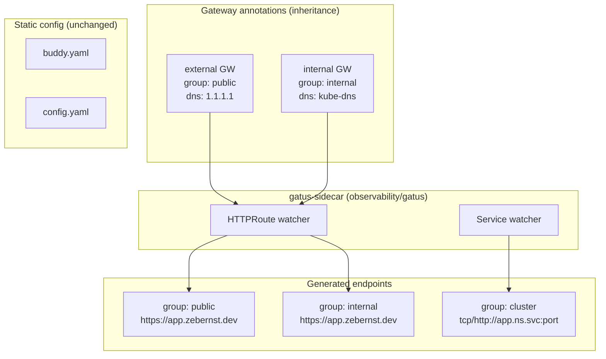

# refactor: Three-tier Gatus exposure model (cluster / internal / public)

## Summary

Adopt a **hybrid annotation model** for Gatus monitoring after the gatus-sidecar migration (#1127): Gateway-level annotations define **public** and **internal** HTTPRoute tiers; Service-level annotations define the **cluster** tier. Do **not** reintroduce kustomize ConfigMap components — that pattern belonged to the removed kiwigrid sidecar and is incompatible with gatus-sidecar’s API discovery model. **DNS exposure guards are deferred** (no upstream changes, no post-processors).

---

## Problem Frame

The repo recently migrated from per-app `kubernetes/components/gatus` ConfigMaps (label `gatus.io/enabled`) to centralized `gatus-sidecar` discovery. That migration left several gaps:

1. **No consistent exposure grouping** — most auto-discovered HTTPRoutes have an empty `group` label in metrics, so `GatusEndpointDown` (`group=~"external|services|minecraft"`) does not cover the majority of sidecar endpoints.
2. **Orphaned `gatus-internal` component** — dead ConfigMap generator using obsolete `gatus.io/enabled` label; safe to delete.
3. **Wrong DNS resolver on internal routes** — fixed on branch `cursor/fix-gatus-internal-dns-f006` by switching the internal Gateway to `kube-dns`; grouping work should build on that fix.
4. **Cluster-only workloads** (Minecraft TCP, future headless services) already use Service annotations with ad hoc groups (`minecraft`) instead of a shared `cluster` convention.

The user wants three exposure levels — **cluster**, **internal**, **public** — with a clear, maintainable configuration model.

---

## Requirements

### Monitoring tiers

- R1. **Public tier** — HTTPRoutes on the `external` Gateway are probed via public DNS (`1.1.1.1`) and labeled `group: public`.
- R2. **Internal tier** — HTTPRoutes on the `internal` Gateway are probed via cluster DNS (`kube-dns`) and labeled `group: internal`.
- R3. **Cluster tier** — Services without HTTPRoute/Ingress exposure are probed in-cluster (auto URL `protocol://name.namespace.svc:port` or explicit `url:` override) and labeled `group: cluster`; discovery remains opt-in via `gatus.home-operations.com/enabled: "true"`.
- R4. Per-app annotations should only override **route-specific** concerns (`path:`, custom `url:`, `enabled: "false"`, app-specific conditions) — not repeat tier defaults on every app.

### Alerting and semantics

- R5. `GatusEndpointDown` must fire for failed health checks in `public`, `internal`, and `cluster` groups (plus existing special groups like `minecraft` during migration).
- R6. Buddy / static endpoints (`buddy`, manual `flux-webhook`) keep their existing groups and alerting paths unchanged.

### Operational constraints

- R7. Configuration must follow gatus-sidecar 0.0.18 capabilities — no upstream modifications, no custom post-processors.
- R8. Changes must be GitOps-friendly: tier defaults live in a small number of shared files (Gateways, Gatus HelmRelease), not N per-app ConfigMaps.

---

## Key Technical Decisions

**KTD1: Gateway annotations, not kustomize components, for public/internal HTTPRoute tiers**

gatus-sidecar watches Kubernetes API objects (HTTPRoute, Service, Gateway). It does **not** consume ConfigMaps generated by kustomize components. Gateway annotations inherit to all child HTTPRoutes — one edit applies tier-wide `group`, `client.dns-resolver`, and default `conditions`.

**KTD2: Service annotations, not components, for cluster tier**

Services have no parent Gateway for inheritance. Cluster-tier monitoring requires per-Service opt-in with `group: cluster` in the `endpoint` annotation.

**KTD3: Skip exposure guards for now**

DNS leak detection (verify no public A record on `1.1.1.1`) is a separate concern from tier health monitoring. gatus-sidecar `guarded: true` replaces HTTP with DNS and is not applicable here. Automatic companion exposure endpoints would require upstream sidecar changes — explicitly out of scope. Remove the orphaned `kubernetes/components/gatus-internal/` directory and the inert `GatusEndpointExposed` VMRule until exposure guards are revisited.

**KTD4: Add sidecar name prefixes to prevent collisions**

Add `--prefix-httproute=route/` and `--prefix-service=svc/` to the sidecar args.

**KTD5: Tailscale tier is out of scope**

Defer a fourth `group: tailscale` until explicitly scoped.

---

## High-Level Technical Design



**Inheritance rule (gatus-sidecar):** Gateway `endpoint` annotation merges first; HTTPRoute child annotation wins on conflicts. Child routes should typically only set `path:` or `enabled: "false"`.

---

## Scope Boundaries

**In scope**

- Gateway annotation updates (`external`, `internal`)
- Gatus sidecar arg cleanup + prefixes
- VMRule group regex updates for health tiers
- Delete orphaned `kubernetes/components/gatus-internal/`
- Migrate Minecraft `group: minecraft` → `group: cluster`
- CLAUDE.md documentation of the three-tier model

**Deferred to follow-up work**

- DNS exposure guards (public A record leak detection for LAN-only apps)
- Tailscale Gateway / Ingress class monitoring (`group: tailscale`)
- Per-route explicit groups for dual-homed apps
- Upgrading gatus-sidecar beyond 0.0.18

**Non-goals**

- Upstream gatus-sidecar modifications
- Reintroducing kiwigrid k8s-sidecar or ConfigMap-based endpoint injection
- Using `guarded: true` (replaces HTTP; not needed after kube-dns fix)

---

## Implementation Units

### U1. Set tier defaults on Gateways

**Goal:** Every HTTPRoute inherits correct `group` and DNS resolver from its parent Gateway.

**Requirements:** R1, R2, R4, R8

**Files:**

- `kubernetes/apps/kube-system/cilium/gateway/external.yaml`
- `kubernetes/apps/kube-system/cilium/gateway/internal.yaml`

**Approach:**

```yaml
# external.yaml
gatus.home-operations.com/endpoint: |
  group: public
  client:
    dns-resolver: tcp://1.1.1.1:53
  conditions:
    - "[STATUS] == 200"

# internal.yaml (merge with DNS fix from PR #1131)
gatus.home-operations.com/endpoint: |
  group: internal
  client:
    dns-resolver: tcp://kube-dns.kube-system.svc:53
  conditions:
    - "[STATUS] == 200"
```

**Test scenarios:**

- External-gateway route (e.g. `kromgo`) shows `group="public"`; internal-gateway route (e.g. `scanopy`) shows `group="internal"`.
- Routes without per-app `group:` override inherit gateway group only.

**Verification:** Gatus metrics populate for auto-discovered routes; internal probes succeed after kube-dns fix.

---

### U2. Harden sidecar discovery args

**Goal:** Prevent endpoint name collisions and remove redundant flags.

**Requirements:** R3, R7

**Dependencies:** U1

**Files:**

- `kubernetes/apps/observability/gatus/app/helmrelease.yaml`

**Approach:**

```yaml
args:
  - --auto-httproute
  - --enable-service
  - --gateway-name=external
  - --gateway-name=internal
  - --prefix-httproute=route/
  - --prefix-service=svc/
```

Remove redundant `--enable-httproute`.

**Verification:** Sidecar writes `/config/gatus-sidecar.yaml`; Gatus pod stays healthy.

---

### U3. Standardize cluster-tier Service annotations

**Goal:** Consistent `group: cluster` for in-cluster-only monitoring.

**Requirements:** R3, R4

**Files:**

- `kubernetes/apps/games/minecraft/vanilla/app/helmrelease.yaml`
- `kubernetes/apps/games/minecraft/atmons/app/helmrelease.yaml`
- `kubernetes/apps/games/minecraft/atm10/app/helmrelease.yaml`
- `CLAUDE.md`

**Approach:** Change `group: minecraft` → `group: cluster`. Document the cluster-tier Service annotation snippet in CLAUDE.md.

**Verification:** Minecraft TCP probes unchanged; metrics show `group="cluster"`.

---

### U4. Update VMRule alerting and remove dead code

**Goal:** Align health alerts with tier groups; remove inert exposure alert and orphaned component.

**Requirements:** R5

**Dependencies:** U1

**Files:**

- `kubernetes/apps/observability/gatus/app/vmrule.yaml`
- `kubernetes/components/gatus-internal/` (delete)

**Approach:**

```yaml
# GatusEndpointDown — health tiers only
gatus_results_endpoint_success{group=~"public|internal|cluster|minecraft"} == 0
```

Remove `GatusEndpointExposed` rule (no exposure endpoints will exist). Remove orphan `services` and legacy `external` from regex once `flux-webhook` migrates to `group: public`. Delete `kubernetes/components/gatus-internal/`.

**Verification:** Internal/public health failures trigger `GatusEndpointDown`; no dangling exposure alert.

---

### U5. Audit per-app HTTPRoute overrides

**Goal:** Ensure per-route annotations remain minimal.

**Requirements:** R4, R6

**Dependencies:** U1

**Files:** Existing annotated HTTPRoutes (plex, seerr, kromgo, scanopy, gatus, flux-webhook).

**Approach:** Confirm annotations only set `path:` or `enabled: "false"`.

**Verification:** No conflicting `group:` or `client:` overrides on child routes.

---

## Risks & Dependencies

| Risk | Mitigation |
|------|------------|
| Endpoint name prefix change resets Gatus history | Accept one-time metric discontinuity |
| Dual-homed routes produce two endpoints with same hostname | Expected; both tiers monitored independently |
| Depends on PR #1131 internal DNS fix | Merge before or with tier grouping |

---

## Open Questions

1. **Minecraft group migration:** Rename to `cluster` immediately, or keep `minecraft` in VMRule regex as legacy alias? Recommendation: **migrate to `cluster`**.
2. **Tailscale fourth tier:** Defer.

---

## Sources & Research

- gatus-sidecar 0.0.18: Gateway inheritance, Service URL shape, `guarded` replaces HTTP (not applicable)
- PR #1127, #1131
- `kubernetes/apps/observability/gatus/app/{helmrelease,vmrule}.yaml`
- `kubernetes/components/gatus-internal/` — delete (orphaned)
