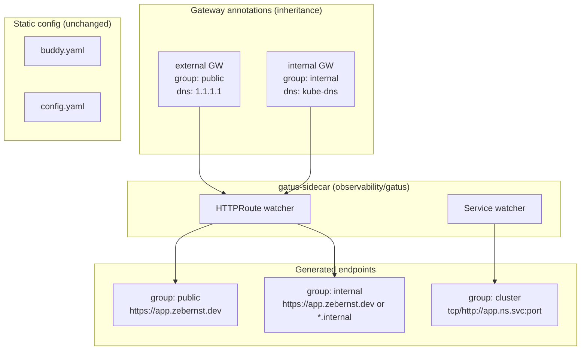

# refactor: Three-tier Gatus exposure model (cluster / internal / public)

## Summary

Adopt a **hybrid annotation model** for Gatus monitoring after the gatus-sidecar migration (#1127): Gateway-level annotations define **public** and **internal** HTTPRoute tiers; Service-level annotations define the **cluster** tier. Do **not** reintroduce three kustomize ConfigMap components — that pattern belonged to the removed kiwigrid sidecar and is incompatible with gatus-sidecar’s API discovery model.

---

## Problem Frame

The repo recently migrated from per-app `kubernetes/components/gatus` ConfigMaps (label `gatus.io/enabled`) to centralized `gatus-sidecar` discovery. That migration left several gaps:

1. **No consistent exposure grouping** — most auto-discovered HTTPRoutes have an empty `group` label in metrics, so `GatusEndpointDown` (`group=~"external|services|minecraft"`) does not cover the majority of sidecar endpoints.
2. **Naming collision** — the orphaned `kubernetes/components/gatus-internal/` component uses `group: internal` for a **DNS leak / exposure guard** (success = no public A record), which conflicts with using `internal` as a LAN/VPN health tier.
3. **Wrong DNS resolver on internal routes** — fixed on branch `cursor/fix-gatus-internal-dns-f006` by switching the internal Gateway to `kube-dns`; grouping work should build on that fix.
4. **Cluster-only workloads** (Minecraft TCP, future headless services) already use Service annotations with ad hoc groups (`minecraft`) instead of a shared `cluster` convention.

The user wants three exposure levels — **cluster**, **internal**, **public** — with a clear, maintainable configuration model.

---

## Requirements

### Monitoring tiers

- R1. **Public tier** — HTTPRoutes on the `external` Gateway are probed via public DNS (`1.1.1.1`) and labeled `group: public`.
- R2. **Internal tier** — HTTPRoutes on the `internal` Gateway are probed via cluster DNS (`kube-dns`) and labeled `group: internal`.
- R3. **Cluster tier** — Services without HTTPRoute/Ingress exposure are probed in-cluster (auto URL `protocol://name.namespace.svc:port` or explicit `url:` override) and labeled `group: cluster`; discovery remains opt-in via `gatus.home-operations.com/enabled: "true"`.
- R4. Per-app annotations should only override **route-specific** concerns (`path:`, custom `url:`, `enabled: "false"`, app-specific conditions) — not repeat tier defaults on every app.

### Alerting and semantics

- R5. `GatusEndpointDown` must fire for failed health checks in `public`, `internal`, and `cluster` groups (plus existing special groups like `minecraft` during migration).
- R6. DNS **exposure guard** checks (success = no public A record) must use a **distinct group name** (`exposure`) so they never collide with internal-tier health checks.
- R7. Buddy / static endpoints (`buddy`, manual `flux-webhook`) keep their existing groups and alerting paths unchanged.

### Operational constraints

- R8. Configuration must follow gatus-sidecar 0.0.18 capabilities — no dependency on unshipped features (e.g. auto-group by gateway name does not exist in 0.0.18).
- R9. Changes must be GitOps-friendly: tier defaults live in a small number of shared files (Gateways, Gatus HelmRelease), not N per-app ConfigMaps.

---

## Key Technical Decisions

**KTD1: Gateway annotations, not kustomize components, for public/internal HTTPRoute tiers**

gatus-sidecar watches Kubernetes API objects (HTTPRoute, Service, Gateway). It does **not** consume ConfigMaps generated by kustomize components. The old `components/gatus` pattern is obsolete. Gateway annotations inherit to all child HTTPRoutes — one edit applies tier-wide `group`, `client.dns-resolver`, and default `conditions`.

**KTD2: Service annotations, not components, for cluster tier**

Services have no parent Gateway for inheritance. Cluster-tier monitoring requires per-Service opt-in (`gatus.home-operations.com/enabled: "true"`) with `group: cluster` in the `endpoint` annotation. A kustomize component **could** patch raw Service manifests, but most apps use app-template HelmReleases where annotations belong in `helmrelease.yaml` values — a component adds indirection without reducing boilerplate.

**KTD3: Optional `components/gatus-cluster` is documentation-only at best**

If added, it should be a **comment/template reference** or a patch for rare raw-manifest apps — not a ConfigMap generator. Default recommendation: **skip new components**; document the Service annotation snippet in CLAUDE.md.

**KTD4: Rename exposure guard group from `internal` → `exposure`**

Reserve `group: internal` for LAN/VPN health. Update `kubernetes/components/gatus-internal/` → rename to `gatus-exposure/` (or delete if replaced by sidecar `guarded: true` on specific routes).

**KTD5: Add sidecar name prefixes to prevent collisions**

When the same app has both a Service and HTTPRoute named identically, Gatus rejects duplicate endpoint names. Add `--prefix-httproute=route/` and `--prefix-service=svc/` to the sidecar args.

**KTD6: Tailscale tier is out of scope for the initial three-tier rollout**

The `tailscale` Gateway exists but is not in `--gateway-name` filter today. Defer a fourth `group: tailscale` until explicitly scoped.

---

## High-Level Technical Design



**Inheritance rule (gatus-sidecar):** Gateway `endpoint` annotation merges first; HTTPRoute child annotation wins on conflicts. Child routes should typically only set `path:` or `enabled: "false"`.

---

## Scope Boundaries

**In scope**

- Gateway annotation updates (`external`, `internal`)
- Gatus sidecar arg cleanup + prefixes
- VMRule group regex updates
- Rename/repurpose exposure guard component
- Migrate Minecraft `group: minecraft` → `group: cluster` (or keep `minecraft` as alias in VMRule during transition)
- CLAUDE.md documentation of the three-tier model

**Deferred to follow-up work**

- Tailscale Gateway / Ingress class monitoring (`group: tailscale`)
- Wiring exposure guard checks to all external-facing apps (separate from health tiers)
- Per-route explicit groups for dual-homed apps (e.g. same hostname on internal + external Gateway)
- Upgrading gatus-sidecar beyond 0.0.18 for future auto-grouping if it ships

**Non-goals**

- Reintroducing kiwigrid k8s-sidecar or ConfigMap-based endpoint injection
- Changing which apps get HTTPRoutes or Gateways (network architecture unchanged)

---

## Implementation Units

### U1. Set tier defaults on Gateways

**Goal:** Every HTTPRoute inherits correct `group` and DNS resolver from its parent Gateway.

**Requirements:** R1, R2, R4, R9

**Files:**

- `kubernetes/apps/kube-system/cilium/gateway/external.yaml`
- `kubernetes/apps/kube-system/cilium/gateway/internal.yaml`

**Approach:** Extend existing `gatus.home-operations.com/endpoint` blocks:

```yaml
# external.yaml
gatus.home-operations.com/endpoint: |
  group: public
  client:
    dns-resolver: tcp://1.1.1.1:53
  conditions:
    - "[STATUS] == 200"

# internal.yaml (merge with DNS fix from PR #1131)
gatus.home-operations.com/endpoint: |
  group: internal
  client:
    dns-resolver: tcp://kube-dns.kube-system.svc:53
  conditions:
    - "[STATUS] == 200"
```

**Patterns to follow:** Existing gateway annotations; sidecar README “parent for common config, child for per-route conditions”.

**Test scenarios:**

- Covers R1/R2. After Flux reconcile, inspect Gatus UI or `/metrics`: an external-gateway route (e.g. `kromgo`) shows `group="public"`; an internal-gateway route (e.g. `scanopy`) shows `group="internal"`.
- Covers R4. Routes without per-app `group:` override inherit gateway group only.

**Verification:** Gatus metrics labels `gatus_results_endpoint_success{group="public"}` and `{group="internal"}` populate for auto-discovered routes; probes succeed for previously failing internal apps.

---

### U2. Harden sidecar discovery args

**Goal:** Prevent endpoint name collisions and remove redundant flags.

**Requirements:** R3, R8

**Dependencies:** U1

**Files:**

- `kubernetes/apps/observability/gatus/app/helmrelease.yaml`

**Approach:**

```yaml
args:
  - --auto-httproute
  - --enable-service          # opt-in Services only; keep OFF --auto-service
  - --gateway-name=external
  - --gateway-name=internal
  - --prefix-httproute=route/
  - --prefix-service=svc/
```

Remove redundant `--enable-httproute` (no-op when `--auto-httproute` is set).

**Test scenarios:**

- App with both Service + HTTPRoute (if any) produces distinct endpoint names (`route/foo`, `svc/foo`) without Gatus startup errors.
- Services without `enabled: "true"` are not monitored.

**Verification:** Sidecar logs show successful write to `/config/gatus-sidecar.yaml`; Gatus pod stays healthy.

---

### U3. Standardize cluster-tier Service annotations

**Goal:** Document and apply consistent `group: cluster` for in-cluster-only monitoring.

**Requirements:** R3, R4

**Files:**

- `kubernetes/apps/games/minecraft/vanilla/app/helmrelease.yaml`
- `kubernetes/apps/games/minecraft/atmons/app/helmrelease.yaml`
- `kubernetes/apps/games/minecraft/atm10/app/helmrelease.yaml`
- `CLAUDE.md` (new “Gatus exposure tiers” subsection)

**Approach:** Change `group: minecraft` → `group: cluster` in Service endpoint annotations. Keep custom `url:`, `conditions:`, and `ui:` blocks unchanged. Document the canonical cluster-tier snippet in CLAUDE.md:

```yaml
gatus.home-operations.com/enabled: "true"
gatus.home-operations.com/endpoint: |
  group: cluster
  # url: tcp://myapp.namespace.svc:8080  # optional override
```

**Test scenarios:**

- Minecraft servers remain reachable via TCP probe; metrics show `group="cluster"`.
- New cluster-only service can be monitored by copying the documented snippet into `service.<name>.annotations`.

**Verification:** Gatus shows Minecraft endpoints under cluster group; TCP `[CONNECTED] == true` unchanged.

---

### U4. Resolve exposure guard naming collision

**Goal:** Separate DNS leak detection from internal-tier health monitoring.

**Requirements:** R6

**Files:**

- `kubernetes/components/gatus-internal/config.yaml` → rename directory to `kubernetes/components/gatus-exposure/`
- `kubernetes/components/gatus-exposure/kustomization.yaml` (update ConfigMap name, label to `gatus.home-operations.com/enabled` if kept as static ConfigMap **or** delete component)
- `kubernetes/apps/observability/gatus/app/vmrule.yaml`

**Approach (choose one during implementation):**

**Option A — Rename + static mount (minimal):** Change `group: internal` → `group: exposure` in component config; mount generated ConfigMaps into Gatus static config path (requires wiring in app ks.yaml files — currently unwired).

**Option B — Sidecar guarded probes (preferred long-term):** Delete the component; add `guarded: true` to HTTPRoute annotations on apps that must not have public DNS. Guarded probes use `1.1.1.1` DNS check automatically.

**Option C — Defer exposure guard:** Delete orphaned component; update VMRule to reference `group="exposure"` only when Option A/B is implemented.

Update VMRule:

```yaml
# GatusEndpointDown — health tiers
gatus_results_endpoint_success{group=~"public|internal|cluster|minecraft"} == 0

# GatusEndpointExposed — exposure guard only
gatus_results_endpoint_success{group="exposure"} == 0
```

Remove orphan `services` from regex (nothing produces it today).

**Test scenarios:**

- Internal-tier health failure triggers `GatusEndpointDown`, not `GatusEndpointExposed`.
- Exposure guard failure (if wired) triggers `GatusEndpointExposed` with correct summary text.

**Verification:** Alert expressions match actual metric labels; no alert silence for newly grouped public/internal routes.

---

### U5. Audit per-app HTTPRoute overrides

**Goal:** Ensure existing per-route annotations remain minimal and correct.

**Requirements:** R4, R7

**Dependencies:** U1

**Files (review only, change only if incorrect):**

- `kubernetes/apps/media/plex/app/helmrelease.yaml`
- `kubernetes/apps/media/seerr/app/helmrelease.yaml`
- `kubernetes/apps/observability/kromgo/app/helmrelease.yaml`
- `kubernetes/apps/observability/scanopy/app/helmrelease.yaml`
- `kubernetes/apps/observability/gatus/app/helmrelease.yaml` (`enabled: "false"`)
- `kubernetes/apps/flux-system/flux-operator/instance/webhook/httproute.yaml` (`enabled: "false"`)

**Approach:** Confirm each annotation only sets `path:` or `enabled:` — remove any stale `group:` or `client:` overrides that fight gateway inheritance.

**Test scenarios:**

- Plex probe hits `/web/index.html` with `group: public`.
- Scanopy probe hits `/api/health` with `group: internal`.
- Gatus and flux-webhook remain excluded from sidecar auto-discovery.

**Verification:** No duplicate or conflicting endpoint entries in Gatus config merge.

---

## Risks & Dependencies

| Risk | Mitigation |
|------|------------|
| Endpoint name prefix change resets Gatus history | Accept one-time metric discontinuity; document in PR |
| Dual-homed routes (same hostname, two gateways) produce two endpoints | Defer explicit per-route `group:` overrides; monitor for confusing duplicates |
| Exposure guard still unwired after rename | VMRule `GatusEndpointExposed` stays inert until guard endpoints exist — acceptable |
| Depends on PR #1131 internal DNS fix | Merge DNS fix before or with this work |

---

## Open Questions

1. **Exposure guard delivery:** Option A (component), B (sidecar `guarded:`), or C (delete for now)? Recommendation: **Option C for this PR**, Option B as follow-up for apps that need leak detection.
2. **Minecraft group migration:** Rename to `cluster` immediately, or keep `minecraft` in VMRule regex permanently as a legacy alias? Recommendation: **migrate to `cluster`** for consistency.
3. **Tailscale fourth tier:** Add in same effort or defer? Recommendation: **defer** (listed in scope boundaries).

---

## Sources & Research

- gatus-sidecar 0.0.18 README and source: Gateway inheritance, Service URL shape, no auto-grouping
- PR #1127: migration from `components/gatus` + kiwigrid sidecar to gatus-sidecar
- PR #1131: internal Gateway DNS fix (`kube-dns` vs `1.1.1.1`)
- `kubernetes/apps/observability/gatus/app/helmrelease.yaml` — current sidecar flags
- `kubernetes/apps/observability/gatus/app/vmrule.yaml` — stale group regexes
- `kubernetes/components/gatus-internal/` — orphaned exposure guard with naming collision
