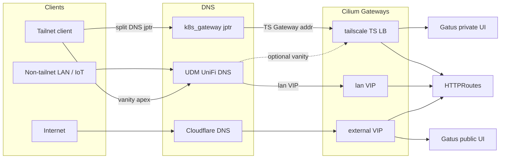
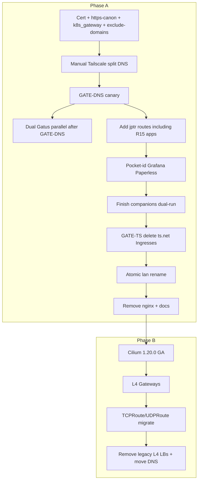

# Gateway API Migration and Tailscale Consolidation - Plan

## Goal Capsule

- **Objective:** Retire ingress-nginx, put all HTTP on Gateway API, consolidate default-private access onto a Tailscale-backed Gateway under `$APP.jptr.zebernst.dev`, reserve apex `*.zebernst.dev` for vanity, keep a VIP `lan` Gateway for non-tailnet devices, split Gatus into public/private instances, then upgrade Cilium to 1.20.0 GA and move L4 onto TCPRoute/UDPRoute.
- **Product authority:** This Product Contract. Existing Cilium Gateways and CLAUDE.md Gatus conventions are starting points; Gateway roles, naming, and dual-Gatus rules in this contract supersede older “internal = primary private path” wording.
- **Open blockers:** None. Cilium 1.20.0 GA is planned 2026-07-29 — Phase B waits for GA (no RC), but sequencing is immediate after Phase A.
- **Execution:** `code`
- **Product Contract preservation:** changed R1/R1a/R2/R3/R3a/R6/R7/R12/R13/AE2/AE3/AE5/AE7; added R2b/R13a/R15/AE6/AE8/AE9; KTD10 dual OIDC redirects; narrowed auth outside-scope carve-out for Grafana/Paperless pocket-id cutover. Unchanged requirements retain prior IDs.

---

## Product Contract

### Summary

Finish the Gateway API migration by making the Tailscale-backed Gateway the default private front door under `$APP.jptr.zebernst.dev` (canonical private name), reserving apex `*.zebernst.dev` for vanity, renaming today’s VIP `internal` Gateway as `lan` for non-tailnet devices, requiring a jptr companion for every external/lan route, removing ingress-nginx and all per-service `*.ts.net` Ingresses, splitting Gatus into public and private instances, then upgrading Cilium to 1.20.0 GA and migrating L4 exposures onto Gateway API.

### Problem Frame

Most HTTP apps already attach to Cilium Gateways, but ingress-nginx remains for leftovers, ~28 apps still publish dedicated `*.kite-harmonic.ts.net` Ingresses, and L4 uses ad-hoc LoadBalancers. Pointing all of `zebernst.dev` at UDM forces one DNS answer for LAN and tailnet and muddies Gateway roles. The preferred model follows Tailscale’s custom-domain + Gateway API pattern (homelab via Cilium `cilium-ts`): a **cluster-hosted authoritative DNS** using CoreDNS **k8s_gateway** (not kube-dns, not ExternalDNS+etcd), advertised to the tailnet via Tailscale split DNS for `jptr.zebernst.dev` only. Default-private apps live under `$APP.jptr` on the Tailscale Gateway; vanity names stay at apex; every external/lan route also has a jptr companion. A VIP `lan` Gateway remains for IoT/media. Cilium 1.19.6 cannot yet host TCPRoute/UDPRoute; 1.20.0 GA is planned 2026-07-29.

### Key Decisions

- **Phased full program, not nginx-only.** Cover HTTP consolidation and later L4/platform work in one plan with a hard phase boundary. *(session-settled: user-directed — chosen over nginx-exit-only or Tailscale-first sequencing alone)*
- **Tailscale-primary default-private path with dedicated private DNS zone `jptr`.** Default private HTTP uses the Tailscale Gateway under `$APP.jptr.zebernst.dev`. Authority is a dedicated CoreDNS **k8s_gateway** deployment (not ExternalDNS-managed etcd). Tailscale split DNS points only that zone at the cluster DNS Service. *(session-settled: user-directed — chosen over subnet-route/LAN-VIP primary, apex-only private names, and ExternalDNS+etcd)*
- **`$APP.jptr` is the canonical private hostname.** Left-most label matches the app identity. Vanity left-labels are for external/lan (e.g. `status`, `requests`, `id`), not under `jptr`. *(session-settled: user-directed)*
- **Every external or lan route also has a jptr companion.** The jptr name is the canonical private/operator URL. For OIDC apps that also keep an external (or lan) vanity hostname, pocket-id registers **both** redirect URIs — external users cannot reach `*.jptr`, which is why OIDC exists on the public path. *(session-settled: user-directed)*
- **VIP `lan` Gateway for non-tailnet devices.** Rename `internal` → `lan`. Apps reachable from IoT/media attach here in addition to their jptr companion. *(session-settled: user-directed)*
- **Drop all per-service Tailscale HTTP Ingresses; no break-glass `*.ts.net`.** *(session-settled: user-directed)*
- **Dual Gatus instances.** Public watches `external` only (`status.zebernst.dev` vanity + `status.jptr` companion). Private watches `lan`+`tailscale` at `$APP.jptr` only — never on the public status page. *(session-settled: user-directed)*
- **Grafana and Paperless pocket-id cutover is in scope.** They use Tailscale identity headers that Cilium Gateway will not inject. *(session-settled: user-directed — narrow exception to prior “auth providers out of scope”)*
- **Ollama is private-zone only.** `ollama.jptr.zebernst.dev`; drop apex and `.internal`. *(session-settled: user-directed)*
- **Cilium ≥1.20 and full L4 Gateway migration are in scope.** Pin `1.20.0` GA (planned 2026-07-29); no RC. *(session-settled: user-directed)*
- **Phase order: HTTP first, then platform + L4.** *(session-settled: user-directed)*

### Requirements

**Access and DNS**

- R1. Deploy a dedicated CoreDNS **k8s_gateway** instance in-cluster (distinct from kube-dns), authoritative for `jptr.zebernst.dev`, watching HTTPRoute (and Service for L4 names), filtered to GatewayClass `cilium-ts`.
- R1a. Configure Tailscale split DNS so queries for `jptr.zebernst.dev` go to that nameserver (UDP+TCP 53). UDM/UniFi remains for LAN/`lan` VIP records, vanity apex, and other existing duties. ExternalDNS UniFi/Cloudflare exclude `jptr.zebernst.dev`.
- R2. Default-private HTTP hostnames are `$APP.jptr.zebernst.dev` on the Tailscale Gateway, with a wildcard certificate for `*.jptr.zebernst.dev`. No new per-service `*.ts.net` Ingresses.
- R2a. Vanity private/public names at `*.zebernst.dev` (or `*.internal` on lan) are opt-in; they are not the default private naming scheme and must not invent vanity labels under `jptr` without a documented exception.
- R2b. Every HTTPRoute parented to `external` or `lan` also has a Tailscale HTTPRoute at `$APP.jptr.zebernst.dev` (canonical private companion). App config may use jptr as the private/operator URL. **OIDC:** when an app keeps an external (or lan) login hostname, pocket-id clients register redirect URIs for **both** `$APP.jptr` and the vanity/public hostname — external users have no access to the jptr zone, so vanity redirects are required for public login.
- R3. Document Gateway and DNS roles: `tailscale` + `$APP.jptr` (canonical private / tailnet), `lan` (VIP for non-tailnet LAN), `external` (public Cloudflare), apex vanity vs jptr defaults. Include reachability trust boundaries and dual status pages (public vanity vs unauthenticated private status on Tailscale ACL).
- R3a. Dual-attached apps (`lan` and/or `external` + Tailscale) use distinct hostnames per path: jptr for humans/operators on tailnet; vanity or `.internal` only where intentionally needed for non-tailnet or public clients. Never attach the same `*.jptr` hostname to both `lan` and `tailscale`.

**Phase A — HTTP consolidation (current Cilium)**

- R4. Every remaining nginx HTTP consumer moves to HTTPRoute on the appropriate Gateway (`tailscale`, `lan`, and/or `external`) without expanding exposure tier.
- R4a. nginx → HTTPRoute cutover preserves each app’s current exposure tier (internal-only / private must not be promoted to `external`; public stays on `external` only if already public). Unintended promotion to `external` fails acceptance.
- R5. ingress-nginx is fully removed: both controllers, Flux kustomization entries, HelmRepository, and leftover class/dashboard references that only exist for nginx.
- R5a. Any Ingress retained solely for ExternalDNS (including mc-router’s Cloudflare DNS Ingress) is replaced with a non-nginx publisher (DNSEndpoint, Service annotation, or already-supported ExternalDNS source) before R5 completes.
- R6. All per-service Tailscale HTTP Ingresses (`className` / `ingressClassName: tailscale`, `*.kite-harmonic.ts.net`) are removed. For each removed Ingress: if no suitable non-`ts.net` HTTPRoute exists, Phase A creates one at `$APP.jptr.zebernst.dev` on the Tailscale Gateway (plus companions for any retained external/lan vanity). Zero break-glass `*.ts.net` exceptions.
- R6a. Before each Tailscale Ingress removal, record whether Tailscale was the sole network ACL and whether the post-cutover audience is private-zone default, vanity apex, `lan`+tailnet, or an explicit exception; require existing app auth or a documented accept-no-auth exception when the network ACL shrinks or widens.
- R7. Default-private HTTPRoutes parent the Tailscale Gateway under `$APP.jptr`. Existing Tailscale attachments that use apex `*.zebernst.dev` (e.g. ollama) migrate to jptr during Phase A. Routes that today parent only VIP `internal` move to jptr and/or `lan` per audience — not wholesale onto VIP as the sole private path.
- R8. The VIP private Gateway is renamed/documented as `lan` (replacing `internal` in operator-facing docs and manifests; atomic rename of Gateway object + all parentRefs).

**Phase B — Cilium upgrade and L4**

- R9. Cilium is upgraded to `1.20.0` GA with Gateway API TCPRoute and UDPRoute usable (experimental CRDs already present at v1.6.1).
- R10. All current L4 exposures migrate to TCPRoute and/or UDPRoute on dedicated L4 Gateways (separate from L7 Gateways), or are explicitly deleted if obsolete: plex, mc-router, steam, qbittorrent, and any others found during inventory. Minecraft RCON Tailscale LoadBalancers (vanilla / atm10 / atmons) are deleted — not migrated to Gateway L4.
- R10a. L4 migration must not expand reachability beyond each service’s pre-migration exposure tier (LAN-only, Tailscale-only, dual, or intentionally public).
- R11. Per-service Tailscale L4 LoadBalancers are removed once equivalent Gateway L4 reachability exists on the intended tier (Tailscale L4 Gateway and/or `lan` L4), unless an explicit R11 keep-exception is documented. Before removal, inventory must evidence reachability-equivalence (ports/backends). **Exception — R10 obsolete deletions:** Minecraft RCON Tailscale LBs (vanilla / atm10 / atmons) are deleted with no Gateway replacement; they are not R11 equivalence candidates and must not gain TCPRoutes “for completeness.”
- R12. DNS publishing: private-zone A/AAAA for HTTPRoutes via k8s_gateway; L4 private names via annotated Services watched by k8s_gateway; UniFi/Cloudflare ExternalDNS for `lan`/vanity/public as today, with `gateway-tcproute` / `gateway-udproute` added to UniFi where needed. Cloudflare keeps explicit DNSEndpoint for public Minecraft → `ipv4.zebernst.dev`.

**Observability, auth, and conventions**

- R13. Gatus is split into two instances named `gatus-external` (public) and `gatus` (private): `gatus-external` discovers only `external` Gateway routes (public vanity `status.zebernst.dev` + companion `status.jptr.zebernst.dev`); `gatus` discovers `lan` + `tailscale` and is published only at `gatus.jptr.zebernst.dev`. Tailscale Ingress annotations are not a remaining discovery path.
- R13a. Public status page must not list private/lan inventory. Private Gatus must never parent the `external` Gateway.
- R14. Operator docs are updated to Gateway-first wording consistent with R3, including a rewrite of the README **Networking & DNS** section for the separate paths (`lan` VIP, Tailscale + `$APP.jptr`, apex vanity, `external` / Cloudflare) and dual status pages.
- R14a. Related README surface that still markets ingress-nginx as a stack component is updated or removed when ingress-nginx is retired.
- R15. Apps that authenticate via Tailscale Ingress identity headers (confirmed: Grafana, Paperless) transition to pocket-id OIDC and prove login on `$APP.jptr` before their Tailscale Ingress is deleted. Re-scan before GATE-TS for any additional header-auth dependencies.

### Key Flows

- F1. Tailnet user opens a default-private app
  - **Trigger:** Device on tailnet opens `$APP.jptr.zebernst.dev`.
  - **Steps:** Tailscale split DNS → k8s_gateway → Tailscale Gateway address → HTTPS → HTTPRoute → Service.
  - **Outcome:** App reachable via canonical private-zone name; name does not need to resolve on UDM for non-tailnet LAN clients.
- F2. Non-tailnet LAN device opens a `lan`-attached app
  - **Trigger:** IoT / media / other device not on the tailnet.
  - **Steps:** UniFi DNS → `lan` Gateway VIP → HTTPRoute → Service.
  - **Outcome:** App reachable without Tailscale when intentionally attached to `lan`; canonical `$APP.jptr` still exists for operators.
- F3. User opens a vanity or public name
  - **Trigger:** Vanity apex (e.g. `status.zebernst.dev`) and/or Cloudflare public.
  - **Steps:** UniFi and/or Cloudflare DNS → Tailscale Gateway and/or `external` per classification.
  - **Outcome:** Short apex names reserved for apps that earn them; every such app also has `$APP.jptr`.
- F4. Game/media L4 after Phase B
  - **Trigger:** Client connects to a TCP/UDP service hostname or published address.
  - **Steps:** DNS → L4 Gateway listener/port (Tailscale and/or `lan` per tier) → TCPRoute/UDPRoute → backend Service.
  - **Outcome:** Per-service Tailscale L4 LoadBalancers are unnecessary when Gateway L4 covers the same tier.



### Acceptance Examples

- AE1. Covers R5, R4, R4a
  - **Given:** victoria-logs previously used `ingressClassName: internal`
  - **When:** Phase A completes
  - **Then:** It is served at `victoria-logs.jptr.zebernst.dev` on `tailscale` (and `lan` only if explicitly classified), not promoted to `external`, and no workload depends on ingress-nginx
- AE2. Covers R6, R1, F1
  - **Given:** An app that had only `app.kite-harmonic.ts.net` Tailscale Ingress
  - **When:** Phase A completes and a tailnet client opens `$APP.jptr.zebernst.dev`
  - **Then:** Split DNS + k8s_gateway resolve to the Tailscale Gateway; the `*.ts.net` Ingress is gone; an HTTPRoute was created if none existed
- AE3. Covers R2a, R7
  - **Given:** ollama uses apex `ollama.zebernst.dev` on the Tailscale Gateway today
  - **When:** Phase A completes
  - **Then:** Hostname is `ollama.jptr.zebernst.dev` only; apex and `.internal` routes are gone
- AE4. Covers R9, R10, R11
  - **Given:** plex exposes LAN and Tailscale LoadBalancers on 32400
  - **When:** Phase B completes
  - **Then:** plex TCP is on TCPRoute/L4 Gateway(s) for its intended tiers; duplicate Tailscale L4 LB is gone unless a documented R11 exception remains
- AE5. Covers R3, R14
  - **Given:** README Networking & DNS still describes Ingress classes `internal`, `tailscale`, and `external`
  - **When:** Phase A completes
  - **Then:** That section describes the separate paths (`lan`, Tailscale + `$APP.jptr`, apex vanity, `external`), dual status pages, and companion naming
- AE6. Covers R13, R13a
  - **Given:** A single Gatus instance today lists public and private endpoints on `status.zebernst.dev`
  - **When:** Phase A completes
  - **Then:** `status.zebernst.dev` shows only public endpoints; private Gatus is on `$APP.jptr` only and covers lan/tailscale
- AE7. Covers R15, R2b
  - **Given:** Grafana uses Tailscale `auth.proxy` headers and `GF_SERVER_ROOT_URL` on `*.ts.net`
  - **When:** Dual-run / before its Tailscale Ingress is deleted (OIDC live; `auth.proxy` disabled; both jptr and any retained vanity redirect URIs registered)
  - **Then:** Login works on `grafana.jptr.zebernst.dev` (and on vanity if dual-attached); after U9, header auth and the `*.ts.net` Ingress are gone
- AE9. Covers R2b (OIDC dual redirects)
  - **Given:** A dual-attached OIDC app has vanity `app.zebernst.dev` on `external` and `$APP.jptr` on Tailscale
  - **When:** pocket-id client is configured
  - **Then:** Redirect URIs include both hostnames; an external (non-tailnet) user can complete OIDC via the vanity URL without needing jptr DNS
- AE8. Covers R2b
  - **Given:** An app has vanity `requests.zebernst.dev` on `external`
  - **When:** Phase A completes
  - **Then:** It also has `seerr.jptr.zebernst.dev` (or the Release `$APP`) on Tailscale

### Success Criteria

**Phase A complete**

- Dedicated k8s_gateway + Tailscale split DNS is live for `jptr.zebernst.dev`.
- No ingress-nginx installation or IngressClass consumers remain.
- Zero per-service Tailscale HTTP Ingresses remain.
- Default-private HTTP uses `$APP.jptr` on Tailscale Gateway; every external/lan route has a jptr companion; VIP path is `lan` for classified non-tailnet apps.
- Dual Gatus: public vanity shows only public; private on jptr covers lan/tailscale.
- Grafana and Paperless (and any re-scan finds) on pocket-id; no Tailscale header auth remaining.
- No unintended promotions to `external`.
- Operator docs match R3/R14, including README Networking & DNS rewrite.
- Ingress-as-DNS leftovers replaced (R5a).

**Phase B complete**

- Cilium is `1.20.0` GA with TCPRoute/UDPRoute available.
- Every inventoried L4 exposure is on Gateway API or explicitly deleted.
- Duplicate Tailscale L4 LoadBalancers removed per R11 (or documented exceptions).
- Transitional `dns-jptr` LB moved onto Tailscale L4 Gateway (or documented exception).
- Operator docs cover dedicated L4 Gateway roles.

### Scope Boundaries

**In scope**

- Phase A: k8s_gateway + Tailscale split DNS + HTTP/nginx/Tailscale-Ingress consolidation onto `$APP.jptr` + vanity apex + `lan` + `external` + companion rule
- Dual Gatus split
- Grafana/Paperless (and re-scan finds) pocket-id cutover required by Tailscale Ingress removal
- Renaming VIP private Gateway as `lan`
- Wildcard cert for `*.jptr.zebernst.dev`
- Phase B Cilium `1.20.0` GA and full L4 Gateway migration
- Docs clarifying Gateway and DNS roles, including README **Networking & DNS**

**Deferred for later**

- Redesigning Cloudflare Tunnel beyond moving leftovers off nginx
- Replacing Cilium Gateway with Envoy Gateway (guide reference only; homelab stays on Cilium unless a hard blocker appears)

**Outside this program**

- Replacing UniFi as the LAN/`lan` DNS authority
- Broad NetworkPolicy / Cilium policy rewrite (except what a specific cutover requires)
- Broad auth-provider redesign beyond the R15 Tailscale-header apps required for Ingress removal

### Dependencies / Assumptions

- Tailscale Kubernetes Operator continues to provision LoadBalancer Services with `loadBalancerClass: tailscale` for the `cilium-ts` GatewayClass.
- Existing HelmRepository `k8s-gateway` (`kubernetes/flux/meta/repositories/helm/k8s-gateway.yaml`) remains usable; chart pin ~`3.4.1`.
- After Phase A, default-private HTTP depends on Tailscale split DNS → k8s_gateway → Tailscale Gateway; treat that path’s regression as a program-level outage mode for that tier.
- Cilium `1.20.0` GA ships as planned (~2026-07-29) with usable TCPRoute/UDPRoute without host-network Gateway mode.
- L4 and L7 cannot share a Gateway in Cilium; Phase B needs dedicated L4 Gateway(s), potentially per VIP/tier.
- Let’s Encrypt (existing `letsencrypt-production` Cloudflare DNS-01) can issue `*.jptr.zebernst.dev`.
- Gateway API experimental CRDs v1.6.1 already installed via Talos machineconfig include TCPRoute/UDPRoute.

### Outstanding Questions

**Deferred (non-blocking)**

- Whether steam’s large TCP/UDP port set stays on LB as an R11 keep-exception after first L4 attempt — decide during U8 with evidence.
- Whether Phase B moves DNS :53 onto `tailscale-l4` in the same PR as other L4 routes or as a follow-up commit within U8 — same unit either way.

*(Resolved in deepening: private Release is `gatus` at `gatus.jptr`; public Release is `gatus-external` at `status.zebernst.dev` + companion `status.jptr`.)*

### Sources / Research

- Tailscale guide: [Use custom domains with Kubernetes Gateway API and Tailscale](https://tailscale.com/docs/solutions/kubernetes-operator-byod-gateway-api)
- k8s_gateway: https://github.com/k8s-gateway/k8s_gateway — watches HTTPRoute/Service/DNSEndpoint; Helm chart already referenced in-repo
- Gateways: `kubernetes/apps/kube-system/cilium/gateway/{internal,external,tailscale}.yaml`
- Cilium chart: `kubernetes/apps/kube-system/cilium/app/helmrelease.yaml` — currently `1.19.6`; GA `1.20.0` planned 2026-07-29
- Apex wildcard cert: `kubernetes/apps/cert-manager/cert-manager/tls/certificates.yaml`
- ExternalDNS: `kubernetes/apps/network/external-dns/{unifi,cloudflare}/helmrelease.yaml`
- Gatus: `kubernetes/apps/observability/gatus/`
- Tailscale header auth: Grafana `auth.proxy` / Paperless `PAPERLESS_ENABLE_HTTP_REMOTE_USER` in their HelmReleases
- Pocket-id OIDC pattern examples: `kubernetes/apps/self-hosted/dawarich/app/helmrelease.yaml`, `kubernetes/apps/downloads/qui/app/helmrelease.yaml`
- README Networking & DNS (to rewrite); runbook: `docs/runbooks/udm-pro-tailscale-dns.md`
- Inventory (planning session): 2 nginx consumers; 28 Tailscale HTTP Ingresses; 1 apex-on-tailscale (ollama); Tailscale L4 LBs = plex-ts + 3× minecraft rcon (rcons deleted in Phase B, not migrated); Gateway API CRDs v1.6.1 experimental already present

---

## Planning Contract

### Key Technical Decisions

- KTD1. **Private DNS = CoreDNS k8s_gateway, not ExternalDNS+etcd.** Single-target zone (all A/AAAA → Tailscale Gateway) does not justify a third ExternalDNS + etcd. Chart from existing HelmRepository; `watchedResources: [HTTPRoute, Service]`; `filters.gatewayClasses: [cilium-ts]`. *(session-settled: user-approved)*
- KTD2. **Phase A DNS exposure = Tailscale LB Service `dns-jptr` (UDP+TCP 53).** Cilium L4 Gateway for :53 waits for 1.20; transitional LB is removed/moved in Phase B.
- KTD3. **Tailscale Gateway dual HTTPS listeners:** `https-canon` (`*.jptr.zebernst.dev` + new cert) and keep `https` (`*.zebernst.dev` + existing cert) for rare apex-on-Tailscale vanity. Default-private routes use `sectionName: https-canon`.
- KTD4. **ExternalDNS `--exclude-domains=jptr.zebernst.dev`** on UniFi and Cloudflare so UniFi never steals jptr ownership from the Tailscale Gateway’s registry label.
- KTD5. **Atomic `internal` → `lan` rename** in one Flux reconcile (Gateway file + all parentRefs + redirect + Gatus args + DNS target). Do not run two Gateways on VIP `192.168.20.21`.
- KTD6. **L4 topology preserves LAN VIPs** via dedicated Gateways (`lan-l4-plex` `.5`, `lan-l4-minecraft` `.65`, `lan-l4-steam` `.16`, `lan-l4-qbittorrent` `.14`) plus one `tailscale-l4` (DNS :53 + plex :32400). Minecraft RCON Tailscale LBs are removed without replacement. *(session-settled: user-directed — chosen over migrating RCON to distinct Tailscale L4 listeners)*
- KTD7. **Cilium pin = `1.20.0` GA only** (planned 2026-07-29). Host-network Gateway mode stays off. Bootstrap helmfile and Flux HelmRelease bump together.
- KTD8. **GATE-DNS before any `*.ts.net` Ingress deletion;** dual-run (≥24h soak preferred) then GATE-TS via **U9**; GATE-NGINX last in Phase A. Pocket-id for R15 apps (U3) is a prerequisite of those apps’ Ingress deletion in U9.
- KTD10. **OIDC dual redirect URIs for dual-attached apps.** Register both `$APP.jptr` and vanity/external (or lan) callback URLs on the pocket-id client. External/public users cannot resolve or reach `*.jptr`; that is why OIDC exists on the public path. jptr-only apps register jptr redirects only. *(session-settled: user-directed — chosen over vanity→jptr login redirect or jptr-only redirects)*

### System-Wide Impact

- **DNS outage modes (tailnet-private tier):** After GATE-DNS, default-private HTTP fails if Tailscale split DNS, `dns-jptr`, or k8s_gateway regresses — treat as program-level outage for that tier (F1), not “one app down.”
- **ExternalDNS exclude:** Without `--exclude-domains=jptr.zebernst.dev` on UniFi/Cloudflare, those providers can publish competing `jptr` answers against k8s_gateway (KTD4 must land in U1).
- **In-cluster DNS for `*.jptr`:** Cluster pods (especially `gatus`) do not inherit Tailscale split DNS; private probes need explicit dns-resolver → k8s_gateway ClusterIP (or a kube-dns forward).
- **Gatus dual instance → metrics/alerts:** Current single VMRule uses `group=~"public|internal|cluster"`. Split requires two scrapes/VMRules, group rename (`internal`→`lan`/`private`), and Gateway annotation updates — else silent coverage loss or public-page leakage (R13a).
- **pocket-id OIDC client sprawl:** Each R15 cutover needs a pocket-id client + secret (qui/dawarich ExternalSecret pattern); issuer remains `id.zebernst.dev`.
- **Flux dependency / rename blast radius:** `k8s-gateway` must `dependsOn` ready Gateways/cert path before U3/U4 consume jptr. U5 atomic rename touches every `parentRefs`→`internal` (~18) plus redirect and Gatus args — partial apply is a LAN outage.
- **Operator docs drift:** Mid-migration, CLAUDE.md / README Ingress-class wording becomes wrong; U6 must land with GATE-NGINX.
- **Companion-rule audit surface:** GATE-TS must cover HelmRelease-embedded routes and standalone HTTPRoutes (redirect, flux-webhook, fission, rook, etc.), not only former `*.ts.net` apps.
- **Private status UI:** `gatus.jptr` is unauthenticated on the Tailscale Gateway — inventory disclosure to the tailnet ACL. Intentional for Phase A; optional auth is out of scope unless later desired.
- **Cilium L4 vs L7:** Dedicated L4 Gateways; preserve VIP IPAM; never collide with L7 VIP `192.168.20.21`.

### Risks & Dependencies

| Risk | Mitigation |
|------|------------|
| Split DNS misconfig (wrong NS IP, UDP-only, zone typo) → jptr blackhole | GATE-DNS: UDP+TCP dig + off-LAN canary; runbook update; no Ingress deletes until green (KTD8) |
| k8s_gateway returns Hostname-only / useless answers | Require `dig` A/AAAA = Tailscale Gateway IP before dual-run |
| UniFi steals `jptr` records | U1 ships `--exclude-domains`; GATE-DNS asserts zero UniFi `jptr` records |
| Auth header loss if Ingress deleted before OIDC | U3 login proof gates U9 for Grafana/Paperless |
| Partial `lan` rename / dual VIP | Single reconcile (KTD5); abort if both Gateways Programmed or mass Accepted=False |
| Cilium 1.20.0 GA slip | Phase B blocked; stay on 1.19.6 HTTP path; no RC |
| Steam multi-port L4 fails cleanly | Documented R11 keep-exception allowed in U8 with evidence |
| Incomplete companion audit | GATE-TS checklist + rg across all external/lan parentRefs |

### High-Level Technical Design



### Assumptions

- Operator will set Tailscale admin split DNS for `jptr.zebernst.dev` after `dns-jptr` has a stable Tailscale IP (manual step; not GitOps).
- Gatus pods resolve `*.jptr` via explicit dns-resolver to k8s_gateway ClusterIP (or kube-dns forward added in U1/U2).
- Existing pocket-id at `id.zebernst.dev` remains the OIDC issuer for R15 and other cutovers. Dual-attached apps get both jptr and vanity/external redirect URIs; jptr-only apps get jptr only.

### Implementation constraints

- Repo-relative paths; Flux ks.yaml / HelmRelease conventions from CLAUDE.md.
- Static validation: `flate test helmrelease|kustomization --path ./kubernetes --allow-missing-secrets`.
- No host-network mode for Cilium Gateway.
- Do not parent the same `*.jptr` hostname to both `lan` and `tailscale`.

### Sequencing

Phase A: U1 → (U2 ∥ U4 route-add) → U3 login proof → finish U4 → U9 → U5 → U6.
- U2 may start any time after GATE-DNS; it is **not** on the U3/U9 critical path (only “public status not listing private” is required before GATE-TS — temporary annotation filters acceptable if U2 incomplete).
- U3 login proof requires jptr HTTPRoutes for Grafana/Paperless first (part of early U4 or a U3 precondition).
- Phase B: U7 → U8 only after Phase A DoD. Hard rule: Phase B does not start until GATE-NGINX + GATE-TS pass.

### Operational / Rollout Notes

**Manual Tailscale split DNS (U1 / GATE-DNS):** Land k8s_gateway + `dns-jptr` + cert + ExternalDNS exclude; wait for stable Tailscale IP; configure Tailscale admin split DNS for `jptr.zebernst.dev` only; record IPs in `docs/runbooks/udm-pro-tailscale-dns.md`; then GATE-DNS. Rollback = remove split-DNS entry first (while `*.ts.net` still exists during dual-run). On U8 DNS move: update split DNS to `tailscale-l4` IP **before** deleting `dns-jptr`.

**Dual-run go/no-go (GATE-DNS → GATE-TS):** Prefer ≥24h soak. Go U9 only when GATE-DNS green; R15 login proven with header auth disabled (Grafana/Paperless have no Gateway listener until OIDC proven); ≥5 spot-checked jptr apps; companion audit complete; R6a auth inventory complete (sole-ACL vs app-auth vs accept-no-auth); public status not listing private (U2 complete or temporary filter); no tier promotions. No-go if split DNS flaky, cert not Ready, or R15 fails.

**Atomic `lan` rename (U5):** One commit/reconcile. Watch Flux Ready, `Gateway/lan` Programmed with VIP `.21`, `Gateway/internal` gone, HTTPRoutes Accepted/ResolvedRefs, redirect OK, ExternalDNS `gw-lan.zebernst.dev`, Gatus `--gateway-name=lan`. Abort if dual VIP or mass Accepted=False.

**Nginx teardown (U6):** After GATE-TS (prefer after U5): confirm U4 already migrated nginx consumers (victoria-logs HTTPRoute + mc-router DNSEndpoint) and cluster has zero nginx-class Ingresses; then delete controllers/repo/dashboards; GATE-NGINX.

**Phase B preflight:** Phase A DoD first; confirm GA `1.20.0` (no RC); L7 smoke baseline; TCPRoute/UDPRoute CRDs present; host-network still off; inventory migrate (plex-ts) vs delete-only (3× RCON).

**RCON:** Operators lose MagicDNS `*-rcon` hostnames; no Gateway replacement — communicate before U8.

---

## Implementation Units

| U-ID | Title | Primary files | Depends on |
|------|-------|---------------|------------|
| U1 | Private-zone DNS, cert, Tailscale listener | `kubernetes/apps/network/k8s-gateway/`, cilium `tailscale.yaml`, ExternalDNS, certs | — |
| U2 | Dual Gatus split | `kubernetes/apps/observability/gatus/` | U1 |
| U4 | Dual-run HTTPRoutes + companions | app HelmReleases / HTTPRoutes | U1 |
| U3 | Pocket-id for Grafana/Paperless | grafana + paperless HelmReleases | U1, early U4 routes for R15 |
| U9 | GATE-TS bulk `*.ts.net` Ingress delete | same app Ingress blocks | U3, U4 |
| U5 | Atomic `internal` → `lan` | cilium gateway manifests + parentRefs | U9 |
| U6 | Remove nginx + docs | ingress-nginx, README, CLAUDE | U5 |
| U7 | Cilium 1.20.0 GA | cilium HelmRelease + helmfile | U6 |
| U8 | L4 Gateways + LB consolidation | lan-l4-*, tailscale-l4, app Services | U7 |

### U1. Private-zone DNS, cert, and Tailscale listener

- **Goal:** Stand up `jptr` authority and Tailscale Gateway listener so canary HTTPS works from the tailnet (GATE-DNS).
- **Requirements:** R1, R1a, R2 (cert/listener portion)
- **Files:**
  - `kubernetes/apps/network/k8s-gateway/` (new: `ks.yaml`, `app/kustomization.yaml`, `app/helmrelease.yaml`)
  - `kubernetes/apps/network/kustomization.yaml`
  - `kubernetes/apps/cert-manager/cert-manager/tls/certificates.yaml`
  - `kubernetes/apps/cert-manager/cert-manager/tls/referencegrant.yaml`
  - `kubernetes/apps/kube-system/cilium/gateway/tailscale.yaml`
  - `kubernetes/apps/network/external-dns/unifi/helmrelease.yaml`
  - `kubernetes/apps/network/external-dns/cloudflare/helmrelease.yaml`
  - `docs/runbooks/udm-pro-tailscale-dns.md` (split-DNS steps)
- **Approach:** Deploy k8s_gateway chart `3.4.1`, zone `jptr.zebernst.dev`, Tailscale LB `dns-jptr` with `useTcp: true`, 2 replicas, `network-critical`. Issue `jptr-zebernst-dev` Certificate + ReferenceGrant. Add `https-canon` listener. Exclude `jptr` from both ExternalDNS instances. Operator configures Tailscale split DNS. Attach canary HTTPRoute; pass GATE-DNS before any Ingress deletions.
- **Test scenarios:**
  - Certificate Ready for `*.jptr.zebernst.dev`
  - UDP and TCP `dig` against `dns-jptr` return Tailscale Gateway **IP** (A/AAAA) for canary hostname
  - HTTPS canary succeeds from off-LAN tailnet client
  - UniFi has no `jptr` records
- **Verification:** GATE-DNS checklist; `flate test` green for touched resources.
- **Dependencies:** None

### U2. Split Gatus into public and private instances

- **Goal:** Public status page no longer lists private inventory; private monitoring lives on jptr.
- **Requirements:** R13, R13a, R2b (gatus companions); KTD9
- **Files:**
  - `kubernetes/apps/observability/gatus/` (restructure into `gatus-external` + `gatus`)
  - `kubernetes/apps/observability/kustomization.yaml` (if needed)
  - Gateway Gatus annotations on `external` / `lan` / `tailscale`
  - `CLAUDE.md` (Gatus tier table)
- **Approach:** Two HelmReleases/DBs/VMRules. `gatus-external`: `--gateway-name=external`; vanity `status.zebernst.dev` + companion `status.jptr.zebernst.dev`. `gatus`: `--gateway-name=internal` + `--gateway-name=tailscale` **until U5**, then flip to `--gateway-name=lan` (do not use `lan` before the Gateway rename). UI at `gatus.jptr.zebernst.dev` only. Explicit jptr dns-resolver for private instance. Place buddy/external-endpoints on `gatus` (keep off `status.zebernst.dev` if they reveal private topology). Update VMRule groups for `public|lan|private|cluster|buddy` (use `internal` group name until U5 if needed).
- **Test scenarios:**
  - Covers AE6. `status.zebernst.dev` lists only public group endpoints
  - `gatus.jptr` reachable only via Tailscale; not on `external`
  - Sidecar discovers VIP + tailscale routes into private instance; private VMRules cover them
- **Verification:** AE6; Gatus UI spot-check; VMRules on expected groups.
- **Dependencies:** U1 (GATE-DNS for jptr UI). Not required before U3/U9.

### U3. Pocket-id cutover for Tailscale header-auth apps

- **Goal:** Grafana and Paperless authenticate without Tailscale Ingress headers before those Ingresses are deleted.
- **Requirements:** R15, R6a
- **Files:**
  - `kubernetes/apps/observability/grafana/app/helmrelease.yaml`
  - `kubernetes/apps/self-hosted/paperless/app/helmrelease.yaml`
  - pocket-id client registration / ExternalSecrets as needed (pattern: `kubernetes/apps/downloads/qui/app/externalsecret.yaml`)
- **Approach:** Follow dawarich/qui OIDC patterns against `https://id.zebernst.dev`. **Hard-block:** do not attach Grafana/Paperless HTTPRoutes to Tailscale until OIDC is configured with `auth.proxy` disabled (`enabled: false`) and `PAPERLESS_ENABLE_HTTP_REMOTE_USER` unset/false — Grafana today has `auth.anonymous` Viewer, so a jptr route with leftover proxy would fail-open to anonymous. Decide keep-or-disable anonymous in U3. Set private/operator URLs to `$APP.jptr`. Register pocket-id redirect URIs for **both** `$APP.jptr` and any retained vanity/external login hostname (external users cannot reach jptr). Prove interactive login on jptr (and on vanity if dual-attached). Re-scan for additional Tailscale-header deps; fold finds into this unit.
- **Test scenarios:**
  - Covers AE7/AE9. Login as real user on `grafana.jptr` and `paperless.jptr` via pocket-id **before** Ingress deletion; if dual-attached, also prove vanity OIDC login
  - pocket-id clients list both jptr and vanity redirect URIs when applicable
  - Grafana `auth.proxy.enabled: false`; Paperless remote-user disabled; `rg` for Tailscale-User / HTTP_TAILSCALE / auth.proxy / PAPERLESS_ENABLE_HTTP_REMOTE_USER returns zero remaining deps (or documented exception)
- **Verification:** AE7, AE9; login proof before U9 deletes those Ingresses.
- **Dependencies:** U1; jptr HTTPRoutes for Grafana/Paperless from early U4 (or created in this unit immediately before OIDC cutover)

### U4. Dual-run HTTPRoutes, companions, and URL rewrites

- **Goal:** Every app has `$APP.jptr` (and companions for external/lan) **while** `*.ts.net` Ingresses still exist; no Ingress deletion in this unit.
- **Requirements:** R2, R2a, R2b, R4, R4a, R5a, R6a, R7
- **Files:** App HelmReleases/HTTPRoutes under `kubernetes/apps/{ai,auth,downloads,games,kube-system,media,observability,rook-ceph,self-hosted}/` (~28 Tailscale Ingress hosts kept; add jptr routes + companion gaps + victoria-logs + mc-router DNSEndpoint + ollama + hardcoded URL envs)
- **Approach:** Dual-run only: add `$APP.jptr` HTTPRoute (`sectionName: https-canon`) while Ingress exists. Companion audit for all external/lan routes. **Ollama carve-out:** set Tailscale hostname to `ollama.jptr.zebernst.dev`; delete `ollama-lan` / `.internal` and any apex `ollama.zebernst.dev` route — do not invent lan/external companions for ollama. victoria-logs → `victoria-logs.jptr` (R4). mc-router DNS Ingress → DNSEndpoint (R5a). Update hardcoded `*.ts.net` URLs to canonical jptr. **R15 exception:** do not parent Grafana/Paperless to Tailscale until U3 OIDC is proven (avoids anonymous Viewer fail-open). **Do not delete Tailscale Ingresses here** (U9 owns deletes).
- **Test scenarios:**
  - Spot-check ≥5 apps on jptr (include one former ts.net-only app)
  - Covers AE1/AE3/AE8 path preparation: victoria-logs, ollama jptr-only, vanity companions exist and Accepted
  - No accidental new `external` parentRefs for formerly private apps
- **Verification:** Dual-run go/no-go checklist; `flate test`.
- **Dependencies:** U1; R15 route attach gated on U3

### U9. GATE-TS — bulk delete Tailscale HTTP Ingresses

- **Goal:** Zero per-service `*.ts.net` HTTP Ingresses after dual-run proof.
- **Requirements:** R6, R6a, R15 (deletion gate)
- **Files:** Same app HelmReleases as U4 — remove `className`/`ingressClassName: tailscale` Ingress blocks only
- **Approach:** After dual-run go/no-go + U3 login proof, delete all Tailscale HTTP Ingresses in one focused wave. No break-glass exceptions.
- **Test scenarios:**
  - Covers AE2. GATE-TS: zero `kite-harmonic.ts.net` / tailscale class in git **and** cluster (`kubectl get ingress -A`)
  - Companion audit still green after deletes
  - Grafana/Paperless still login on jptr without Ingress
- **Verification:** GATE-TS checklist.
- **Dependencies:** U3, U4

### U5. Atomic `internal` → `lan` rename

- **Goal:** VIP private Gateway named `lan` with all parents updated; no dual-VIP downtime window.
- **Requirements:** R8, R3
- **Files:**
  - `kubernetes/apps/kube-system/cilium/gateway/internal.yaml` → `lan.yaml`
  - `kubernetes/apps/kube-system/cilium/gateway/kustomization.yaml`
  - `kubernetes/apps/kube-system/cilium/gateway/redirect.yaml`
  - All remaining `parentRefs.name: internal`
  - Gatus sidecar `--gateway-name=lan`
- **Approach:** Single commit/reconcile renaming Gateway metadata, DNS target `gw-lan.zebernst.dev`, annotations/groups, and all parentRefs. Preserve VIP `192.168.20.21` and listeners. Follow Operational / Rollout Notes Flux watches.
- **Test scenarios:**
  - Gateway `lan` Programmed; VIP unchanged; `Gateway/internal` gone
  - Redirect and retained lan routes Accepted/ResolvedRefs
  - Zero stale `parentRefs` to `internal`
- **Verification:** Flux Ready; `kubectl get gateway -n kube-system`; parentRef rg.
- **Dependencies:** U9

### U6. Remove ingress-nginx and update operator docs

- **Goal:** No nginx left; README/CLAUDE/runbook describe Gateway-first paths.
- **Requirements:** R5, R14, R14a, R3
- **Files:**
  - `kubernetes/apps/network/ingress-nginx/` (delete)
  - `kubernetes/apps/network/kustomization.yaml`
  - `kubernetes/flux/meta/repositories/helm/ingress-nginx.yaml` + parent kustomization
  - `kubernetes/apps/observability/grafana/app/helmrelease.yaml` (nginx dashboards)
  - `README.md`, `CLAUDE.md`, `docs/runbooks/udm-pro-tailscale-dns.md`
- **Approach:** Confirm zero nginx-class Ingress consumers in cluster (U4 already migrated victoria-logs + mc-router DNSEndpoint), then delete controllers/repo/dashboards. Rewrite Networking & DNS for four paths + dual status pages + companion rule. Do **not** re-own R4/R5a migration in this unit.
- **Test scenarios:**
  - Covers AE5. GATE-NGINX: no ingress-nginx pods/HelmReleases/IngressClass consumers
  - README no longer documents Ingress-class methods as primary
- **Verification:** AE5; `rg ingress-nginx` in kubernetes/README/CLAUDE; live `kubectl get ingress -A`.
- **Dependencies:** U5

### U7. Cilium 1.20.0 GA upgrade

- **Goal:** Platform ready for TCPRoute/UDPRoute without regressing Phase A HTTP.
- **Requirements:** R9
- **Files:**
  - `kubernetes/apps/kube-system/cilium/app/helmrelease.yaml`
  - `kubernetes/bootstrap/helmfile.yaml`
- **Approach:** After GA publish (planned 2026-07-29), pin `1.20.0` in Flux + helmfile. Keep Gateway Service mode (no host-network). Confirm TCPRoute/UDPRoute CRDs present. Smoke-test L7 Gateways per Phase B preflight.
- **Test scenarios:**
  - Cilium HelmRelease Ready at 1.20.0
  - Existing HTTP Gateways still Programmed; sample jptr/lan/external HTTPS OK
  - TCPRoute/UDPRoute CRDs exist
- **Verification:** Flux/Cilium health; HTTP smoke.
- **Dependencies:** U6 (Phase A complete)

### U8. L4 Gateways and LoadBalancer consolidation

- **Goal:** Inventoried L4 on Gateway API; remove duplicate Tailscale L4 LBs; delete RCON Tailscale LBs; move DNS off transitional LB.
- **Requirements:** R10, R10a, R11, R12
- **Files:**
  - `kubernetes/apps/kube-system/cilium/gateway/lan-l4-*.yaml`, `tailscale-l4.yaml`, kustomization
  - plex / minecraft / steam / qbittorrent HelmReleases (Services → TCPRoute/UDPRoute)
  - minecraft vanilla/atm10/atmons HelmReleases (delete rcon Tailscale Services only)
  - ExternalDNS UniFi sources (`gateway-tcproute`, `gateway-udproute`)
  - k8s_gateway watched Service annotations for private L4 names
- **Approach:** Create L4 Gateways preserving LAN VIPs. Migrate plex (lan+ts), mc-router (lan), steam (lan), qbittorrent (lan). Prove reachability-equivalence. Remove plex-ts Service. **Delete** three RCON Tailscale LoadBalancers with **no** TCPRoutes. Move split DNS target to `tailscale-l4` :53 **before** deleting `dns-jptr`. Steam may remain R11 keep-exception with evidence.
- **Test scenarios:**
  - Covers AE4. plex LAN + Tailscale
  - Minecraft public DNS still → `ipv4.zebernst.dev` / VIP `.65`
  - Zero RCON Tailscale LoadBalancers; zero RCON TCPRoutes
  - Split DNS updated → dig OK → then `dns-jptr` deleted
  - No unintended public expansion
- **Verification:** GATE-L4; connect tests; `kubectl get tcproute,udproute,svc -A`.
- **Dependencies:** U7

---

## Verification Contract

**Static / CI**

```bash
flate test helmrelease --path ./kubernetes --allow-missing-secrets
flate test kustomization --path ./kubernetes --allow-missing-secrets
```

**Manifest greps (Phase A end)** — pair with live cluster checks

```bash
rg -n 'kite-harmonic\.ts\.net|ingressClassName:\s*tailscale|className:\s*tailscale' kubernetes/apps
rg -n 'ingress-nginx' kubernetes README.md CLAUDE.md
rg -n 'parentRefs:[\s\S]*name:\s*internal' kubernetes/apps --glob '*.yaml' -U
rg -n 'Tailscale-User|HTTP_TAILSCALE|auth\.proxy|PAPERLESS_ENABLE_HTTP_REMOTE_USER' kubernetes/apps
kubectl get ingress -A
kubectl get svc -A -o wide | rg 'tailscale|ingress-nginx|rcon|dns-jptr' || true
```

**GATE-DNS (before deleting any `*.ts.net` Ingress)**

- Certificate Ready; Gateways Programmed; canary HTTPRoute Accepted+ResolvedRefs
- `dig` UDP+TCP @dns-jptr → Tailscale L7 Gateway **IP**; record nameserver IPs in runbook
- `curl` HTTPS canary from off-LAN tailnet (second client preferred)
- No UniFi `jptr` records
- Rollback known: remove Tailscale split-DNS entry

**Dual-run exit (before U9)**

- ≥24h soak preferred; R15 login proven with header auth off and no fail-open anonymous Gateway path; ≥5 spot-checks; companion audit; R6a auth inventory (sole-ACL / app-auth / accept-no-auth); public status not listing private; no tier promotions

**GATE-TS**

- Zero Tailscale HTTP Ingresses in git and cluster
- Companion audit: every external/lan HTTPRoute has `$APP.jptr`
- No new `external` parentRefs for formerly private apps
- R6a inventory complete for every removed Ingress

**GATE-NGINX**

- Zero nginx-class Ingress consumers in cluster **before** deleting controllers (U4 owns migrations)
- No ingress-nginx controllers/repos after delete

**GATE-L4 (Phase B)**

- TCPRoute/UDPRoute Ready for migrated services; connect tests on old+new paths before deleting Services
- RCON: Services gone; **no** RCON TCPRoutes
- DNS: split DNS updated → dig OK → then delete `dns-jptr`

**Runtime proof**

- Interactive login for Grafana/Paperless (R15)
- Gatus public vs private UI content check (R13)
- Smoke HTTPS on `lan` / `tailscale` / `external` after Cilium upgrade

---

## Definition of Done

**Global**

- All Implementation Units U1–U9 complete with verifications green (U7–U8 after 1.20.0 GA).
- Product Contract success criteria for Phase A and Phase B satisfied.
- Abandoned experimental manifests from failed attempts removed from the diff.
- README / CLAUDE / runbook match the shipped Gateway and DNS model.

**Per phase**

- Phase A: GATE-DNS, dual-run exit, GATE-TS, GATE-NGINX, AE1–AE3, AE5–AE9.
- Phase B: Cilium 1.20.0 Ready, GATE-L4, AE4.

**Cleanup**

- No leftover `internal` Gateway file, dual Gatus half-migrations, transitional DNS LB after U8 (unless documented R11 keep-exception), or RCON Tailscale LBs/TCPRoutes.
