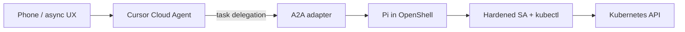

# Homelab Agent Orchestration - Plan

## Goal Capsule

- **Objective:** Let long-running agents reach and act on the homelab with tool execution and cluster credentials staying in-cluster, while Cursor Cloud Agents remain the phone/async entry point and planner on a flat Cursor Pro subscription.
- **Product authority:** This plan owns the agent runtime topology (Cloud Agent ↔ A2A ↔ Pi-in-OpenShell), v1 cluster access posture, and billing/fallback spine. Observability MCP, Kata hardening, and a custom phone launcher are not active scope.
- **Open blockers:** None that block planning. Adapter and RBAC detail are deferred to planning.

## Product Contract

### Summary

Deploy OpenShell sandboxes in the cluster running Pi as peer agents. Cursor Cloud Agents (phone/async) plan and delegate work over **A2A** (thin adapter allowed in v1). Workers use a hardened ServiceAccount and kubectl for cluster access in v1. Keep Cursor Pro as the primary flat fee; ChatGPT Plus/Pro is the Pi fallback. Design for later observability MCP and phone-agnostic entry beyond Cloud Agents, but do not ship those in v1.

### Problem Frame

Managed Cursor Cloud Agents can start from a phone with the laptop closed, but tool execution runs on Cursor’s VMs. Reaching the lab via Tailscale still pulls tool results (and any logs/secrets an agent can read) onto Cursor hardware and into model context. Self-hosted Cursor workers would keep execution local but require Enterprise. The operator wants tools and credentials as local as possible, inference elsewhere, a flat monthly AI spend, and a path that does not paint into a Cursor-only corner for future harnesses like Pi.

### Key Decisions

- **Hybrid D topology** — Cursor Cloud Agent as brain/phone front door; Pi in OpenShell as hands. `(session-settled: user-approved — chosen over Pi-only primary: keeps phone/async on Cursor Pro while tools stay in-cluster.)` Governs R1, R2, R8.
- **A2A for agent↔agent** — Target contract for Cloud Agent → in-cluster peer; no long-term MCP-exec product API. `(session-settled: user-directed — chosen over MCP-exec or A2A-day-one-only: right layer; thin adapter OK for v1.)` Governs R3.
- **v1 cluster access = SA + kubectl** — Not a Kubernetes MCP in v1. `(session-settled: user-directed — chosen over k8s MCP primary: simpler; MCP reserved for later obs backends.)` Governs R4, R5.
- **Observability MCP later** — VictoriaLogs/metrics MCP designed for, not shipped in v1. `(session-settled: user-directed — chosen over metrics/logs MCP in v1.)` Governs R9.
- **Billing spine** — Cursor Pro primary; ChatGPT Plus/Pro fallback for Pi; unofficial Cursor→Pi bridge allowed for CLI/fallback only. `(session-settled: user-directed — chosen over dropping Cursor or dual official subs as primary.)` Governs R6, R7.
- **OpenShell default isolation first** — Kata/microVM optional later, not day-one. `(session-settled: user-approved — chosen over Kata-from-day-one or Docker-host-first target.)` Governs R1.
- **Minimize sensitive egress** — Prefer summary-oriented returns across the Cloud Agent boundary; deny logs/secrets/exec on the worker SA where feasible. Governs R5, R10.

### Actors

- A1. Homelab operator (Zach) — starts work from phone or laptop; reviews PRs and agent output.
- A2. Cursor Cloud Agent — planner/orchestrator on Cursor-managed infra; A2A client (directly or via adapter).
- A3. Pi peer agent — coding/ops agent loop inside an OpenShell sandbox.
- A4. OpenShell gateway + Agent Sandbox — provisions and isolates sandbox workloads on the cluster.
- A5. Cluster API (via worker ServiceAccount) — read-oriented kubectl surface for v1.

### Key Flows

- F1. Phone-started lab task
  - **Trigger:** Operator starts a Cloud Agent from phone with a homelab/ops task.
  - **Actors:** A1, A2, A3, A4, A5
  - **Steps:** Cloud Agent plans; delegates a task over A2A (or thin adapter) to a Pi peer in OpenShell; Pi uses SA+kubectl within policy; returns task artifacts/status to the Cloud Agent; operator reviews on phone.
  - **Covered by:** R1, R2, R3, R4, R8
- F2. Laptop CLI / fallback loop
  - **Trigger:** Operator runs Pi against OpenShell without Cloud Agents (or Cloud Agents unavailable).
  - **Actors:** A1, A3, A4, A5
  - **Steps:** Pi authenticates with Cursor bridge or ChatGPT fallback; works in sandbox with same SA posture; no requirement for A2A in this path.
  - **Covered by:** R1, R6, R7
- F3. Sensitive-data refusal
  - **Trigger:** Peer or Cloud Agent attempts logs, secrets, or exec-style access.
  - **Actors:** A3, A5
  - **Steps:** SA/RBAC and/or tool policy deny; agent reports blocked capability rather than exfiltrating payloads upstream.
  - **Covered by:** R5, R10

### Requirements

**Runtime topology**

- R1. The system runs Pi peer agents inside OpenShell sandboxes on the homelab Kubernetes cluster (Agent Sandbox + OpenShell gateway).
- R2. Cursor Cloud Agents remain the supported phone/async entry point for starting and continuing lab-facing agent work on Cursor Pro.
- R3. Cloud Agent → in-cluster peer delegation uses A2A as the product contract; v1 may ship a thin adapter, but must not standardize on MCP-exec as the long-term API.

**Cluster access and safety**

- R4. v1 cluster interaction from the peer uses a dedicated ServiceAccount and kubectl (or equivalent API client), not a Kubernetes MCP server.
- R5. The worker identity is cluster-wide read-oriented and denies Secrets, log retrieval, and exec-style access (and equivalent high-sensitivity verbs/resources).
- R10. Across the Cloud Agent boundary, prefer task status and summaries over dumping raw cluster objects that are likely to contain personal or secret-adjacent data.

**Billing and harness fallback**

- R6. Primary AI spend remains a flat Cursor Pro subscription for Cloud Agent inference.
- R7. Pi CLI/fallback may use an unofficial Cursor→Pi bridge on that same sub, with ChatGPT Plus/Pro as the documented fallback if the bridge fails or is unsuitable.
- R8. A laptop CLI path against the same OpenShell/Pi/SA stack remains viable without Cloud Agents.

**Deferred capabilities (design hooks only)**

- R9. Architecture leaves a clear place for later MCP servers for observability backends (e.g. VictoriaLogs, metrics) without requiring them in v1.
- R11. Architecture must not preclude a future non-Cursor phone launcher; v1 does not implement one.

### Acceptance Examples

- AE1. Covers R2, R3, R4.
  - **Given:** OpenShell + A2A adapter (or thin shim) are reachable from a Cloud Agent environment over the private path.
  - **When:** The operator starts a Cloud Agent from a phone asking for cluster pod health in an app namespace.
  - **Then:** A Pi peer in OpenShell performs the reads via the hardened SA; the Cloud Agent reports status without requiring the laptop to be open.
- AE2. Covers R5, R10.
  - **Given:** A peer attempts to fetch pod logs or read a Secret.
  - **When:** The request hits the worker identity / policy.
  - **Then:** The attempt is denied; no log bodies or Secret data are returned upstream to the Cloud Agent.
- AE3. Covers R7, R8.
  - **Given:** The unofficial Cursor→Pi bridge is broken or declined for a session.
  - **When:** The operator uses the CLI fallback path.
  - **Then:** Pi can authenticate via ChatGPT Plus/Pro and still use the same OpenShell sandbox + SA posture.

### Success Criteria

- A phone-started Cloud Agent can complete a read-only cluster observe task using in-cluster peer execution (per AE1).
- Secrets/logs/exec are not obtainable through the worker path (per AE2).
- CLI fallback works without Cloud Agents (per AE3).
- Planning can proceed without choosing Enterprise self-hosted Cursor workers or a second metered AI subscription as the primary spine.

### Scope Boundaries

**In scope (v1)**

- OpenShell + Agent Sandbox on the cluster
- Pi as the in-sandbox peer agent
- A2A target contract + thin adapter as needed
- Hardened SA + kubectl for cluster access
- Cursor Cloud Agent as phone/async front door
- Cursor Pro + ChatGPT fallback billing spine
- CLI/fallback path with optional unofficial Cursor→Pi bridge

**Deferred for later**

- Observability MCP (VictoriaLogs, metrics, etc.)
- Kata/microVM RuntimeClass hardening
- Custom phone launcher replacing Cloud Agents
- Thicker response redaction beyond RBAC/tool denial
- Dual Cursor environments (gitops-only vs lab-observe) as a hard split

**Out of scope / rejected**

- Cursor self-hosted worker pools (Enterprise-only on current sub)
- Making MCP-exec the durable Cloud Agent ↔ sandbox API
- Requiring local homelab GPU inference
- Treating unofficial Cursor bridges as a supported phone path substitute for Cloud Agents

### Dependencies / Assumptions

- Homelab already runs Tailscale Operator and private ingress patterns usable by Cloud Agent environments and/or gateways.
- OpenShell’s Kubernetes path is early; expect operational rough edges.
- Cursor Cloud Agents can reach private HTTP(S)/MCP-style endpoints (directly or via adapter) once networking and secrets are configured; native A2A client support in Cursor is not assumed.
- Unofficial Cursor→Pi bridges carry ToS and breakage risk; they are fallback/CLI, not the phone path.
- Claude Pro/Max via Pi may incur metered extra usage and is not the chosen flat-fee spine.

### Outstanding Questions

**Deferred to Planning**

- Thinnest A2A adapter shape given Cursor’s actual client capabilities (e.g. MCP-wrapped A2A gateway vs other shim).
- Concrete RBAC Role/ClusterRole: resource/verb allowlist and namespace exceptions if any.
- OpenShell/Agent Sandbox packaging in this repo’s Flux/app-template patterns.
- How Cloud Agent environments authenticate to the private path (Tailscale userspace vs alternate).
- Which unofficial Pi Cursor bridge package to document for CLI, if any, versus ChatGPT-only fallback.
- Whether Pi runs as the sole sandbox entrypoint image or shares a base OpenShell image with Pi installed.

### Sources / Research

- Cursor self-hosted Cloud Agents are Enterprise; docs recommend managed agents + Tailscale/private connectivity before worker fleets: [choose runtime](https://cursor.com/docs/cloud-agent/choose-runtime), [self-hosted](https://cursor.com/docs/cloud-agent/self-hosted).
- OpenShell Kubernetes: Agent Sandbox CRDs + Helm gateway; experimental K8s path; [OpenShell Helm](https://github.com/NVIDIA/OpenShell/blob/main/deploy/helm/openshell/README.md).
- A2A vs MCP: complementary layers (agent↔agent vs agent↔tool); [A2A protocol](https://a2a-protocol.org/latest/).
- Pi providers: official ChatGPT/Copilot/Claude OAuth; Cursor via community packages only; [Pi providers](https://pi.dev/docs/latest/providers).
- Repo already has Tailscale Operator and `tailscale` Gateway under `kubernetes/apps/network/` and `kubernetes/apps/kube-system/cilium/gateway/`.
